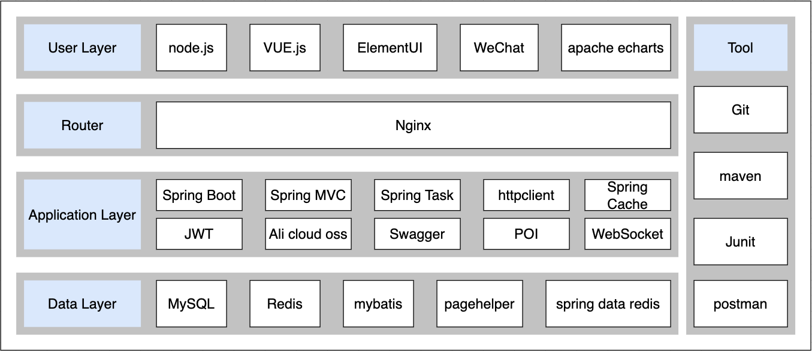
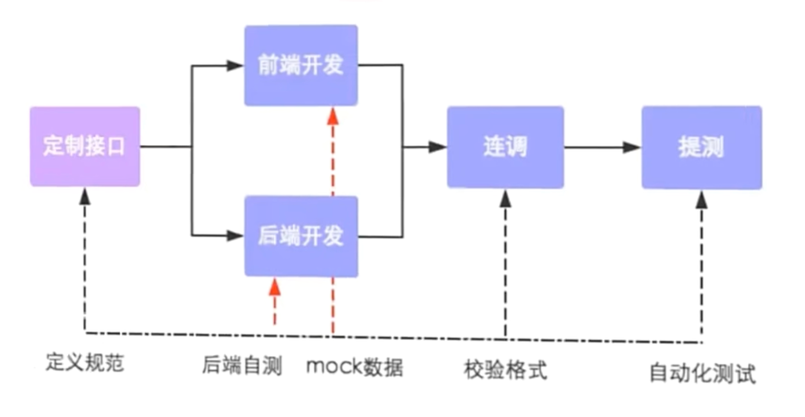
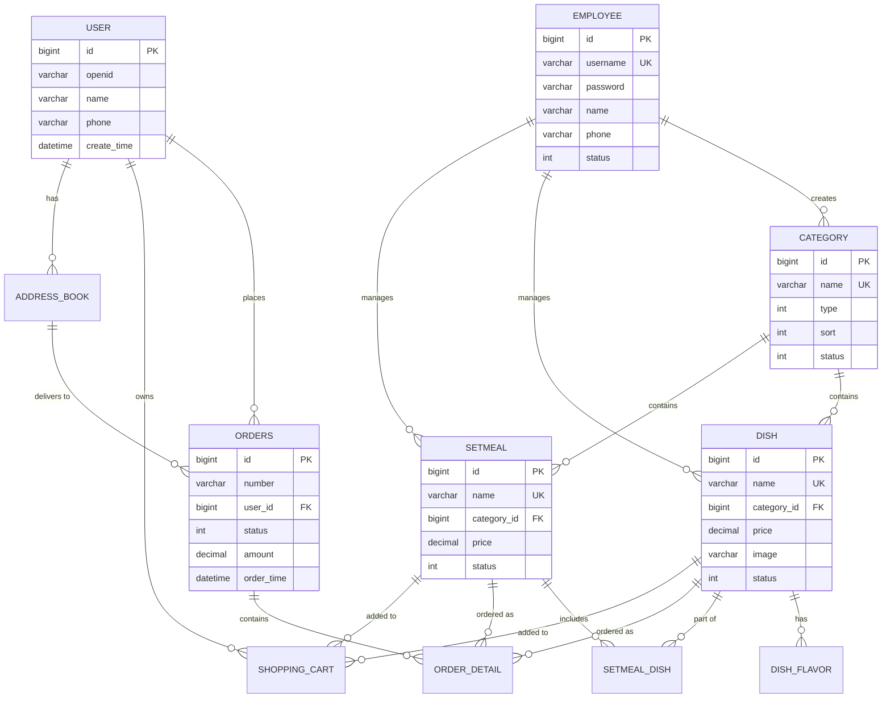

# 📖 Table of Contents

## Project Intro

- [Project Introduction](#project-overview) 

## 🏗️ Project Setup

- [📋 Prerequisites](#prerequisites)
- [⚡ Quick Start](#quick-start)
- [🛠️ Installation Guide](#installation-guide)
- [🔧 Configuration](#configuration)

## 📚 Documentation

- [🚀 API Documentation](#api-documentation)
  - [🔐 Authentication](#authentication)
  - [👨‍💼 Admin APIs](#admin-apis)
  - [👤 User APIs](#user-apis)
  - [📄 Response Format](#response-format)
- [💾 Database Schema](#database)
  - [📊 ER Diagram](#table-relationships)
  - [🔧 Setup Instructions](#setup-instructions-1)
- [🎨 Frontend Guide](#frontend)
  - [🚀 Quick Start](#quick-start-1)
  - [🌐 Nginx Configuration](#nginx)

## 🏛️ Architecture & Implementation

- [🏗️ Backend Architecture](#backend)
  - [🔒 JWT Authentication System](#general-jwt-token-interceptors)
  - [👥 Employee Management](#admin-add-new-employee)
  - [🔐 WeChat Integration](#client-wechat-login)
- [🎯 Key Features](#key-features-implemented)
- [📈 Technical Highlights](#technical-highlights)

## 💡 Additional Resources

- [🗄️ Redis Integration](#redis)
- [🌐 HTTP Client Usage](#httpclient)
- [🐛 Troubleshooting](#troubleshooting)

---

# 📋 Prerequisites

Before running this application, ensure you have:

- **Java 8+** - Backend runtime environment
- **MySQL 5.7+** - Primary database
- **Redis** - Caching and session management
- **Node.js** - Frontend build tools (optional)
- **Nginx** - Reverse proxy and static file serving
- **WeChat Developer Account** - For mini-program integration

# ⚡ Quick Start

1. **Clone the repository**

   ```bash
   git clone https://github.com/your-username/yummy-spicy.git
   cd yummy-spicy
   ```

2. **Setup Database**

   ```bash
   mysql -u root -p < yummy-backend/yummy.sql
   ```

3. **Configure Application**

   ```bash
   # Copy and edit configuration
   cp application-dev.yml.example application-dev.yml
   # Update database and WeChat credentials
   ```

4. **Start Backend**

   ```bash
   cd yummy-backend
   mvn spring-boot:run
   ```

5. **Start Frontend**

   ```bash
   sudo nginx -c /path/to/nginx.conf
   ```

6. **Access Application**

   - Admin Dashboard: `http://localhost`
   - API Documentation: `http://localhost:8080/doc.html`
   - Default Login: `admin` / `123456`

# 🛠️ Installation Guide

## Backend Setup

1. **Build the project**

   ```bash
   cd yummy-backend
   mvn clean package
   ```

2. **Run the application**

   ```bash
   java -jar yummy-server/target/yummy-server-1.0.jar
   ```

## Frontend Setup

1. **Configure Nginx**

   ```nginx
   server {
       listen 80;
       server_name localhost;
       location /api/ {
           proxy_pass http://localhost:8080/admin/;
       }
   }
   ```

2. **Start Nginx**

   ```bash
   sudo nginx -c /path/to/your/nginx.conf
   ```


# 🔧 Configuration

## Database Configuration

```yaml
spring:
  datasource:
    url: jdbc:mysql://localhost:3306/yummy_spicy
    username: your_username
    password: your_password
```

## WeChat Mini Program

```yaml
yummy:
  wechat:
    appid: your_wechat_appid
    secret: your_wechat_secret
```

## JWT Settings

```yaml
yummy:
  jwt:
    admin-secret-key: your_admin_secret
    user-secret-key: your_user_secret
    admin-ttl: 72000000  # 20 hours
    user-ttl: 72000000   # 20 hours
```

---

# 🐛 Troubleshooting

## Common Issues

### Database Connection Failed

```bash
# Check MySQL service
sudo systemctl status mysql

# Verify credentials in application.yml
spring.datasource.username=your_username
spring.datasource.password=your_password
```

### Nginx Port Conflicts

```bash
# Check what's using port 80
sudo lsof -i :80

# Use alternative port in nginx.conf
listen 8080;
```

### JWT Token Issues

- Verify secret keys in configuration
- Check token expiration settings
- Ensure proper header format: `Bearer <token>`

### WeChat Integration Issues

- Verify WeChat appid and secret
- Check HTTPS requirements for production
- Validate authorization code format

# Yummy-Spicy Restaurant Management System

## Project Overview

**Yummy-Spicy** is a comprehensive full-stack restaurant management system built with modern web technologies. The project demonstrates enterprise-level software architecture, implementing both administrative management tools and customer-facing applications for a complete restaurant operations solution.

## Technical Architecture

### Backend (Spring Boot)
- **Framework**: Spring Boot 2.x with Maven multi-module architecture
- **Database**: MySQL with MyBatis ORM for data persistence
- **Authentication**: Dual JWT system (admin employees + WeChat users)
- **API Design**: RESTful APIs with comprehensive Swagger documentation
- **Security**: JWT interceptors, password encryption, input validation
- **Caching**: Redis for restaurant status and session management

### Frontend & Integration
- **Admin Panel**: Web-based dashboard for restaurant management
- **Customer Interface**: WeChat Mini Program for mobile ordering
- **Reverse Proxy**: Nginx for load balancing and static file serving
- **File Upload**: Local storage with OSS integration support

### Key Features Implemented

#### Admin Management System
- **Employee Management**: Complete CRUD operations with role-based access
- **Menu Management**: Dynamic dish and setmeal (combo) configuration
- **Category Management**: Hierarchical food category organization
- **Order Processing**: Real-time order tracking and status management
- **File Upload**: Image management for dishes and promotional content

#### Customer Experience
- **WeChat Integration**: Seamless login via WeChat Mini Program
- **Menu Browsing**: Real-time menu with availability status
- **Shopping Cart**: Persistent cart management across sessions
- **Order Management**: Order placement and tracking functionality

## Technical Highlights

### Advanced Spring Boot Features
- **AOP Integration**: Automatic field population for audit trails
- **Custom Interceptors**: JWT validation and request context management
- **Global Exception Handling**: Centralized error management
- **Dynamic SQL**: MyBatis XML for flexible database queries
- **Pagination**: Efficient PageHelper implementation for large datasets

### Database Design
- **11-table Schema**: Normalized design supporting complex business relationships
- **Dual Authentication**: Separate user systems for employees and customers
- **Audit Trails**: Comprehensive tracking of create/update operations
- **Flexible Menu System**: Support for individual dishes and combination meals

### Security & Performance
- **Stateless Authentication**: JWT tokens with configurable expiration
- **Password Security**: MD5 encryption with secure defaults
- **Thread Safety**: ThreadLocal for request context isolation
- **SQL Injection Prevention**: Parameterized queries throughout
- **Efficient Pagination**: Optimized database queries for large datasets

## Project Impact & Learning Outcomes

This project showcases expertise in:
- **Full-Stack Development**: End-to-end application development
- **Enterprise Architecture**: Scalable, maintainable code structure  
- **Database Design**: Complex relational database modeling
- **API Development**: RESTful service design and documentation
- **Security Implementation**: Authentication, authorization, and data protection
- **Third-Party Integration**: WeChat API integration for mobile payments
- **DevOps Practices**: Nginx configuration and deployment strategies

## Business Value

The system addresses real restaurant operational needs including staff management, inventory control, customer engagement, and order processing. The WeChat integration targets the Chinese market where WeChat Mini Programs are widely adopted for business applications.

---

*This project demonstrates advanced Spring Boot development skills, database design expertise, and the ability to integrate complex business requirements into a cohesive technical solution.*

---

# Tech Stack



# API Documentation

## API Design Philosophy

The API follows RESTful design principles with clear separation between admin and user endpoints:

- **Admin APIs** (`/admin/**`): Full CRUD operations for restaurant management
- **User APIs** (`/user/**`): Read-only operations for customers browsing menu
- **Consistent Response Format**: All endpoints return `Result<T>` wrapper
- **JWT Authentication**: Separate token validation for admin and user access



## API Tools

- **API Manager**: Yapi for API specification management
- **API Testing**: Swagger UI for interactive testing at `/doc.html`
- **Documentation**: Auto-generated using Knife4j

## Admin APIs

### Employee Management (`/admin/employee`)

| Method | Endpoint | Description | Request | Response |
|--------|----------|-------------|---------|----------|
| `POST` | `/login` | Employee login | `EmployeeLoginDTO` | `Result<EmployeeLoginVO>` |
| `POST` | `/logout` | Employee logout | - | `Result<String>` |
| `POST` | `/` | Add new employee | `EmployeeDTO` | `Result` |
| `GET` | `/page` | Employee pagination | Query params | `Result<PageResult>` |
| `POST` | `/status/{status}` | Update employee status | Path + Query | `Result` |
| `GET` | `/{id}` | Get employee by ID | Path variable | `Result<Employee>` |
| `PUT` | `/` | Update employee | `EmployeeDTO` | `Result` |

**Example Request - Employee Login:**
```json
POST /admin/employee/login
{
  "username": "admin",
  "password": "123456"
}
```

**Example Response:**
```json
{
  "code": 1,
  "msg": null,
  "data": {
    "id": 1,
    "userName": "admin",
    "name": "Administrator",
    "token": "eyJhbGciOiJIUzI1NiJ9..."
  }
}
```

### Category Management (`/admin/category`)

| Method | Endpoint | Description | Request | Response |
|--------|----------|-------------|---------|----------|
| `POST` | `/` | Add new category | `CategoryDTO` | `Result<String>` |
| `GET` | `/page` | Category pagination | Query params | `Result<PageResult>` |
| `PUT` | `/` | Update category | `CategoryDTO` | `Result<String>` |
| `POST` | `/status/{status}` | Update category status | Path + Query | `Result<String>` |
| `DELETE` | `/` | Delete category | Query param | `Result<String>` |
| `GET` | `/list` | List categories by type | Query param | `Result<List<Category>>` |

### Dish Management (`/admin/dish`)

| Method | Endpoint | Description | Request | Response |
|--------|----------|-------------|---------|----------|
| `POST` | `/` | Add new dish | `DishDTO` | `Result` |
| `GET` | `/page` | Dish pagination | Query params | `Result<PageResult>` |
| `DELETE` | `/` | Delete dishes (batch) | `List<Long> ids` | `Result` |
| `GET` | `/{id}` | Get dish by ID | Path variable | `Result<DishVO>` |
| `PUT` | `/` | Update dish | `DishDTO` | `Result` |
| `GET` | `/list` | List dishes by category | Query param | `Result<List<Dish>>` |

### Setmeal Management (`/admin/setmeal`)

| Method | Endpoint | Description | Request | Response |
|--------|----------|-------------|---------|----------|
| `POST` | `/` | Add new setmeal | `SetmealDTO` | `Result` |
| `GET` | `/page` | Setmeal pagination | Query params | `Result<PageResult>` |
| `DELETE` | `/` | Delete setmeals (batch) | `List<Long> ids` | `Result` |
| `GET` | `/{id}` | Get setmeal by ID | Path variable | `Result<SetmealVO>` |
| `PUT` | `/` | Update setmeal | `SetmealDTO` | `Result` |
| `POST` | `/status/{status}` | Update setmeal status | Path + Query | `Result` |

### File Upload (`/admin/common`)

| Method | Endpoint | Description | Request | Response |
|--------|----------|-------------|---------|----------|
| `POST` | `/upload` | Upload files locally | `MultipartFile` | `Result<String>` |
| `POST` | `/ossupload` | Upload files to OSS | `MultipartFile` | `Result<String>` |

### Restaurant Status (`/admin/shop`)

| Method | Endpoint | Description | Request | Response |
|--------|----------|-------------|---------|----------|
| `PUT` | `/{status}` | Set restaurant status | Path variable | `Result` |
| `GET` | `/status` | Get restaurant status | - | `Result<Integer>` |

## User APIs

### User Authentication (`/user/user`)

| Method | Endpoint | Description | Request | Response |
|--------|----------|-------------|---------|----------|
| `POST` | `/login` | WeChat login | `UserLoginDTO` | `Result<UserLoginVO>` |

**Example Request - WeChat Login:**
```json
POST /user/user/login
{
  "code": "WeChat_authorization_code_from_wx.login()"
}
```

**Example Response:**
```json
{
  "code": 1,
  "msg": null,
  "data": {
    "id": 1,
    "openid": "oMgZeweKSuODzH3JlD3z8Vx1uT8s",
    "token": "eyJhbGciOiJIUzI1NiJ9..."
  }
}
```

### Category Browsing (`/user/category`)

| Method | Endpoint | Description | Request | Response |
|--------|----------|-------------|---------|----------|
| `GET` | `/list` | Browse categories | `type` (query) | `Result<List<Category>>` |

### Dish Browsing (`/user/dish`)

| Method | Endpoint | Description | Request | Response |
|--------|----------|-------------|---------|----------|
| `GET` | `/list` | Browse dishes by category | `categoryId` (query) | `Result<List<DishVO>>` |

### Setmeal Browsing (`/user/setmeal`)

| Method | Endpoint | Description | Request | Response |
|--------|----------|-------------|---------|----------|
| `GET` | `/list` | Browse setmeals by category | `categoryId` (query) | `Result<List<Setmeal>>` |
| `GET` | `/dish/{id}` | Get dishes in setmeal | Path variable | `Result<List<DishItemVO>>` |

### Restaurant Status (`/user/shop`)

| Method | Endpoint | Description | Request | Response |
|--------|----------|-------------|---------|----------|
| `GET` | `/status` | Check restaurant status | - | `Result<Integer>` |

## Response Format

All APIs use a consistent response wrapper:

```json
{
  "code": 1,        // 1: success, 0: failure
  "msg": "string",  // Error message (null on success)
  "data": {}        // Response data (null on failure)
}
```

### Success Response
```json
{
  "code": 1,
  "msg": null,
  "data": {
    // Actual response data
  }
}
```

### Error Response
```json
{
  "code": 0,
  "msg": "Error description",
  "data": null
}
```

## Authentication

### Admin Authentication
- **Header**: `token`
- **Format**: `Bearer <JWT_TOKEN>`
- **Scope**: All `/admin/**` endpoints except `/admin/employee/login`

### User Authentication
- **Header**: `authentication` 
- **Format**: `Bearer <JWT_TOKEN>`
- **Scope**: All `/user/**` endpoints except `/user/user/login` and `/user/shop/status`

## Common Status Codes

| Code | Description |
|------|-------------|
| `200` | Success |
| `400` | Bad Request - Invalid parameters |
| `401` | Unauthorized - Invalid or missing token |
| `403` | Forbidden - Insufficient permissions |
| `404` | Not Found - Resource doesn't exist |
| `500` | Internal Server Error |

## Pagination

List endpoints support pagination with these query parameters:

- `page`: Page number (starting from 1)
- `pageSize`: Number of items per page
- `name`: Optional search filter

**Example Pagination Request:**
```
GET /admin/employee/page?page=1&pageSize=10&name=john
```

**Example Pagination Response:**
```json
{
  "code": 1,
  "msg": null,
  "data": {
    "total": 25,
    "records": [
      // Array of items for current page
    ]
  }
}
```

# Database

## Overview

The yummy-spicy restaurant management system uses **MySQL** as its primary database. The complete database schema is defined in `yummy.sql` and includes 11 tables supporting restaurant operations from menu management to order processing.

## Database Schema

### Core Tables

#### 1. User Management
- **`employee`** - Admin staff information and authentication
- **`user`** - WeChat customer profiles and authentication

#### 2. Menu System  
- **`category`** - Food categories (dishes/setmeals)
- **`dish`** - Individual dishes with pricing and descriptions
- **`dish_flavor`** - Customizable flavor options for dishes
- **`setmeal`** - Meal packages/combos
- **`setmeal_dish`** - Many-to-many relationship between setmeals and dishes

#### 3. Order Management
- **`orders`** - Customer orders with payment and delivery info
- **`order_detail`** - Line items for each order
- **`shopping_cart`** - Temporary cart storage for users
- **`address_book`** - Customer delivery addresses

## Table Relationships



## Key Features

### 1. **Dual Authentication System**
- **Employee Table**: Username/password authentication for admin staff
- **User Table**: WeChat OpenID authentication for customers

### 2. **Flexible Menu Structure**
- **Categories**: Support both dish categories (type=1) and setmeal categories (type=2)
- **Dishes**: Individual menu items with customizable flavors
- **Setmeals**: Package deals containing multiple dishes

### 3. **Comprehensive Order Management**
- **Shopping Cart**: Temporary storage before checkout
- **Orders**: Complete order lifecycle with status tracking
- **Order Details**: Line-by-line breakdown of items ordered

### 4. **Address Management**
- **Address Book**: Multiple delivery addresses per user
- **Default Address**: Automatic selection for faster checkout

## Common Status Values

### Dish/Setmeal Status
- `0`: Disabled/Out of Stock
- `1`: Enabled/Available

### Order Status
- `1`: Pending Payment
- `2`: Pending Confirmation
- `3`: Confirmed
- `4`: In Delivery
- `5`: Completed
- `6`: Cancelled
- `7`: Refunded

### Payment Status
- `0`: Unpaid
- `1`: Paid
- `2`: Refunded

## Database Configuration

### Connection Settings
```yaml
spring:
  datasource:
    url: jdbc:mysql://localhost:3306/yummy_spicy
    username: ${DB_USERNAME:root}
    password: ${DB_PASSWORD:password}
    driver-class-name: com.mysql.cj.jdbc.Driver
```

### MyBatis Configuration
```yaml
mybatis:
  mapper-locations: classpath:mapper/*.xml
  type-aliases-package: com.yummy.entity
  configuration:
    map-underscore-to-camel-case: true
```

## Setup Instructions

### 1. **Database Creation**
```bash
mysql -u root -p < yummy-backend/yummy.sql
```

### 2. **Verify Installation** 
```sql
USE yummy_spicy;
SHOW TABLES;
SELECT COUNT(*) FROM category;  -- Should return sample data
```

### 3. **Default Admin Account**
- **Username**:
- **Password**: 
- **ID**: `1`

## Performance Considerations

### Indexes
- **Unique Constraints**: `username`, `dish.name`, `category.name`, `setmeal.name`
- **Foreign Keys**: Automatic indexing on relationship columns
- **Custom Indexes**: Consider adding indexes on frequently queried columns

### Data Storage
- **Images**: Stored as URLs pointing to external storage (OSS/local)
- **JSON Data**: Flavor options stored as JSON strings in `dish_flavor.value`
- **Timestamps**: Automatic tracking of create/update times

## Backup and Maintenance

### Regular Backups
```bash
mysqldump -u root -p yummy_spicy > backup_$(date +%Y%m%d).sql
```

### Database Monitoring
- Monitor connection pool usage
- Track slow query logs
- Regular index optimization


# Redis

- in-memory storage
- NoSQL: key-value
- key: String
- 5 data type for value
  - String
    - `set key value`
    - `get key`
    - `setex key seconds value` : set with expiration time
    - `setnx key value` : set if the key not exist
  - hash: field-value (similar with HashMap)
    - for Object
    - 
  - list: sorted (similar with LinkedList)
  - set: unsorted (similar with HashSet)
  - sorted set: every element in set link with a score
- 

# HttpClient

- sub-project of Apache Jakarta Common

- ```xml
  <dependency>
  	<groupId>org.apache.httpcomponents</groupId>
    <artifactId>httpclient</artifactId>
    <version></version>
  </dependency>
  ```

