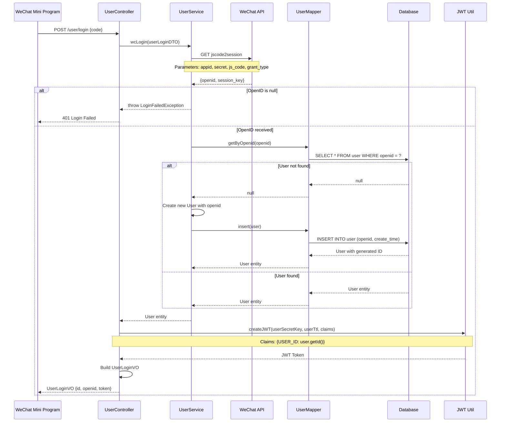
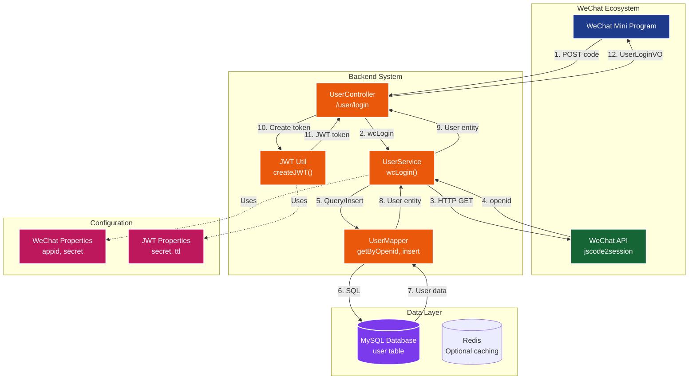

# Project introduction also for CV


# User needs

# Stack


# API 

## API Design

- api design / frontend and backend development
  

## API Manager

- Yapi

## API Testing

- Swagger

# Frontend

## How to start frontend project

- In mac os we don't run `nginx.exe` instead 
- run nginx: `sudo nginx -c /your/path/to/nginx.conf # run nginx` 

## Nginx

- debug

  

- Nginx reverse proxy

  - 
  - what is it?
    - request address in browser http://localhost/api/employee/login and in backend /admin/employee/login --> this is Nginx reverse proxy
    - browser doesn't and can't send request to backend directly, it should send to Nginx server first and Nginx server will forward it to the backend
    - ```nginx
      server {
        listen 80;
        server_name localhost;
        location /api/ {
          proxy_pass http://localhost:8080/admin/;
        }
      }
      ```
    - 
  - why use it?
    - make sure that browser can't visit backend server directly so server can be safe
    - when there are a lot request from frontend, Nginx server will help to send request to different server, lower the load of one server
    - some resource/static site will be stored in Nginx server and when you visit it again, no need to go to backend server, Nginx can response to that request directly

  - advantages

    - raise visit speed

    - load balancing (负载均衡)

      ```nginx
      upstream webservers {
      	  server 127.0.0.1:8080 weight=90 ;
      	  #server 127.0.0.1:8088 weight=10 ;
      }
      server {
        listen 80;
        server_name localhost;
        location /api/ {
          proxy_pass http://webservers/admin/;
        }
      }
      ```

      

    - ensure security of backend server

    - 

- Is nginx running correctly?

  - `ps aux | grep nginx` : will print out the running nginx information

- 是否在监听某个端口？ `lsof -i :4040` 

- test nginx conf: `sudo nginx -t -c /your/custom/path/nginx.conf`

- run nginx: `sudo nginx -c /Users/hurjiang/.../nginx.conf #启动nginx` 


# Database

- is designed and created already in `yummy_spicy.sql`
- 

# Backend

## Project structure

| number | modul name    | description                                                  |
| ------ | ------------- | ------------------------------------------------------------ |
| 1      | yummy-backend | maven father project, manage the dependencies for the whole project |
| 2      | yummy-common  | sub-modul for common classes, like: tool class, constant class, exception class and so on |
| 3      | yummy-pojo    | sub-modul for entity class, VO, DTO and so on                |
| 4      | yummy-server  | sub-modul for backend-server, contains dependencies files, Controller, Service, Mapper and so on |

### yummy-pojo


| Name                           | ..   |
| ------------------------------ | ---- |
| Entity                         |      |
| DTO (Data Transmission Object) |      |
| VO (View Data)                 |      |
| POJO ()                        |      |

## GlobalExceptionHandler

- a centralized mechanism that catches and handles unhandled or unexpected exceptions that occur anywhere in the application ==> it avoids writing repetitive try-catch block in multiple places

## Message converter of Spring MVC


## Add new employee

- Controller
  ```java
  @PostMapping
  @ApiOperation("Add new employee")
  public Result save(@RequestBody EmployeeDTO employeeDTO) {
      log.info("add new employee: {}", employeeDTO);
      employeeService.save(employeeDTO);
      return Result.success();
  }
  ```

- EmployeeServiceImpl
  ```java
  public void save(EmployeeDTO employeeDTO) {
  
  		Employee employee = new Employee();
      // object property copy
      BeanUtils.copyProperties(employeeDTO, employee);
      // set the rest properties
      employee.setStatus(StatusConstant.ENABLE);
      employee.setPassword(DigestUtils.md5DigestAsHex(PasswordConstant.DEFAULT_PASSWORD.getBytes()));
      employee.setCreateTime(LocalDateTime.now());
      employee.setUpdateTime(LocalDateTime.now());
      // #TODO: id of creator and editor
      employee.setCreateUser(10L);
      employee.setUpdateUser(10L);
  
      employeeMapper.insert(employee);
  }
  ```

  

- EmployeeMapper
  ```java
  @Insert("insert into employee (name, username, password, phone, sex, id_number, status, " +
              "create_time, update_time, create_user, update_user) " + "values " +
              "(#{name}, #{username}, #{password}, #{phone}, #{sex}, #{idNumber}, #{status}, " +
              "#{createTime}, #{updateTime}, #{createUser}, #{updateUser})")
      void insert(Employee employee);
  ```


### Exception handle for unique username

- `username` is unique in the database

- if you want to add another user with the existing username, you will get the following error: java.sql.SQLIntegrityConstraintViolationException: Duplicate entry 'jiang' for key 'employee.idx_username' 

- Solution: handle the exception with GlobalExceptionHandler
  ```java
  @ExceptionHandler
  public Result exceptionHandler(SQLIntegrityConstraintViolationException ex){
      String message = ex.getMessage();
      if(message.contains("Duplicate entry")) {
          String[] split = message.split(" ");
          String username = split[2];
          String msg = username + MessageConstant.ALREADY_EXISTS;
          return Result.error(msg);
      } else {
          return Result.error(MessageConstant.UNKNOWN_ERROR);
      }
  }
  ```

  

### get/set creator/editor of new employee


- Solution: ThreadLocal
  ```java
  public class BaseContext {
  
      public static ThreadLocal<Long> threadLocal = new ThreadLocal<>();
      public static void setCurrentId(Long id) {
          threadLocal.set(id);
      }
      public static Long getCurrentId() {
          return threadLocal.get();
      }
      public static void removeCurrentId() {
          threadLocal.remove();
      }
  }
  ```

- Encapsulate ThreadLocal in BaseContext //#TODO: What is ThreadLocal?

  - ThreadLocal: every current thread own the same storage?


## Employee page query

### PageHelper

### Frontend ==> Backend

- Frontend passes data to backend: `name`, `page`, `pageSize` 

- we use EmployeePageQueryDTO to encapsulate the data
  ```java
  public class EmployeePageQueryDTO implements Serializable {
    private String name;
    private int pageNumber;
    private int pageSize;
  }
  ```

- 

### Backend ==> Frontend

- `PageResult`: the result of page query will be encapsulated in this class

  ```java
  public class PageResult implements Serializable {
    private long total; // 
    private List records; // the data/employees of the current page
  }
  ```

  


## Change employee status

### pass current status through path

### mapper xml update

## Edit employee

### get employee by id

### update employee

## Category - add new category

## Category - page query

#TODO: all about category need to be completed in .md file

## Auto fill public field


- enum
- annotation
- AOP
- reflection

### Annotation: AutoFill


### Enum: OperationType

## Alioss Util

#TODO: not understand yet

- `AliOss.upload()` 


## Add new dishes


### upload picture and store locally

- WebMvcConfiguration ==> set up static resource mapping
  ```java
  protected void addResourceHandlers(ResourceHandlerRegistry registry) {
  
    registry.addResourceHandler("/doc.html").addResourceLocations("classpath:/META-INF/resources/");
    registry.addResourceHandler("/webjars/**").addResourceLocations("classpath:/META-INF/resources/webjars/");
    registry.addResourceHandler("/upload/**")
            .addResourceLocations("file:" + uploadDir + "/");
  }
  ```

- nginx !!! You have to set the reverse proxy !!!

  ```nginx
  location /upload/ {
      proxy_pass http://localhost:4041/upload/;
  }
  ```

- application-dev.yml
  ```yaml
  yummy:  
  	file:
      upload-dir: /Users/hurjiang/Documents/101_cs_hc/101_cs_code/yummy-spicy/yummy-backend/yummy-server/src/main/resources/upload
      access-url: http://localhost:4040/upload
  ```

  

- "\upload"

  ```java
  @PostMapping("/upload")
  @ApiOperation("Upload files locally")
  public Result<String> uploadLocally(MultipartFile file) {
      String filename = file.getOriginalFilename();
      String extension = filename.substring(filename.lastIndexOf('.'));
      String newFileName = UUID.randomUUID().toString() + extension;
      File dest = new File(uploadDir + File.separator + newFileName);
      try {
          file.transferTo(dest);
          // 返回前端可访问的 URL
          String fileUrl = accessUrl + "/" + newFileName;
          return Result.success(fileUrl);
      } catch (IOException e) {
          log.error(MessageConstant.UPLOAD_FAILED, e);
      }
      return Result.error(MessageConstant.UPLOAD_FAILED);
  }
  ```

  

## dish page query

- Frontend pass `DishDTO` to the Backend

- Controller receive `DishDTO` and Controller will return `Result<PageResult>` back to Frontend

- `DishServiceImpl`:

  - `Page<DishVO> page = dishMapper.pageQuery(dishPageQueryDTO);` 

- `DishMapper.xml` 

  ```xml
  <select id="pageQuery" resultType="com.yummy.vo.DishVO">
          select d.*, c.name as categoryName from dish d left join category c on d.category_id = c.id
      <where>
          <if test="name != null">
              and d.name like concat('%', #{name}, '%')
          </if>
          <if test="categoryId != null">
              and d.category_id = #{categoryId}
          </if>
          <if test="status != null">
              and d.status = #{status}
          </if>
      </where>
      order by d.create_time desc
  </select>
  ```

  ## delete dish

  

  

## update dishes


### get dish by id


### update dish


## Set meal

### Task

- Complete all business functions of the Package Management module, including:

  - Adding new set meal
  - set meal paging query
  - Delete set meal
  - Modify set meal
  - enable or disable set meal

- Requirements:
  1. conduct requirement analysis based on product prototype, analyze the business rules
  2. Design interfaces
  3. sort out the relationship between tables (category table, dish table, set menu table, flavor table, set menu dish relationship table)
  4. code implementation according to the interface design
  5. testing the functionality through swagger interface documentation and front-end and back-end tuning respectively.

### add new setmeal

#### list dish by category id

- How to search by name of dish?
  

### setmeal paging query

- User SetmealVO

  ```java
  Page<SetmealVO> page = setmealMapper.pageQuery(setmealPageQueryDTO);
  ```

- SQL
  ```xml
  <select id="pageQuery" resultType="com.yummy.vo.SetmealVO">
      select sm.*, ct.name from setmeal sm left join category ct on sm.category_id = ct.id
      <where>
          <if test="name != null"> and sm.name like concat('%', #{name}, '%') </if>
          <if test="categoryId != null"> and sm.category_id = #{categoryId}</if>
          <if test="status != null"> and sm.status = #{status} </if>
      </where>
      order by create_time desc
  </select>
  ```

  

### delete setmeal

### update setmeal

### enable or disable setmeal

## Restaurant status

- no need to create a new table in MySQL for restaurant status, we use Redis!


## Client

### WeChat Login

#### Overview
The WeChat login feature enables users to authenticate using their WeChat Mini Program credentials. The system exchanges a WeChat-provided code for a unique OpenID, which is used to identify and authenticate users.

#### Architecture

##### System Flow Diagram


##### Component Architecture


#### Implementation

##### API Endpoint
- **POST** `/user/login`
- **Request Body**: `UserLoginDTO`
  ```json
  {
    "code": "WeChat_authorization_code"
  }
  ```
- **Response**: `UserLoginVO`
  ```json
  {
    "id": 1,
    "openid": "wechat_openid",
    "token": "jwt_token"
  }
  ```

##### Core Components

###### 1. UserController (`/user/login`)
- Receives WeChat login request with authorization code
- Calls `UserService.wcLogin()` to process login
- Creates JWT token with user ID
- Returns `UserLoginVO` with user info and token

###### 2. UserService Implementation
**wcLogin() Method Process:**
1. **Exchange Code for OpenID**: Calls WeChat API to get unique OpenID
2. **User Validation**: Checks if OpenID exists in database
3. **User Creation**: Creates new user record if first-time login
4. **Return User**: Returns user entity for JWT token creation

**getOpenid() Method:**
- Makes HTTP GET request to WeChat API endpoint
- Parameters: `appid`, `secret`, `js_code`, `grant_type`
- Parses JSON response to extract OpenID

###### 3. UserMapper
- **getByOpenid()**: Queries user by WeChat OpenID
- **insert()**: Creates new user record with auto-generated ID

##### Database Schema

**User Table:**
```sql
CREATE TABLE user (
    id BIGINT AUTO_INCREMENT PRIMARY KEY,
    openid VARCHAR(45) UNIQUE NOT NULL,
    name VARCHAR(32),
    phone VARCHAR(11),
    sex VARCHAR(2),
    id_number VARCHAR(18),
    avatar VARCHAR(500),
    create_time DATETIME
);
```

##### Configuration

**WeChat Properties** (`application.yml`):
```yaml
yummy:
  wechat:
    appid: your_wechat_mini_program_appid
    secret: your_wechat_mini_program_secret
  jwt:
    user-secret-key: your_jwt_secret
    user-ttl: 72000000  # 20 hours
    user-token-name: authentication
```

##### Security Features

1. **JWT Token Authentication**
   - Separate secret key for user tokens
   - 20-hour token expiration
   - Token contains user ID claim

2. **OpenID Validation**
   - Validates OpenID received from WeChat API
   - Throws `LoginFailedException` for invalid responses

3. **Automatic User Registration**
   - Creates new user on first login
   - Stores WeChat OpenID and creation timestamp

##### Error Handling

- **Invalid Code**: Returns 401 if WeChat API returns no OpenID
- **API Failure**: Handles WeChat API communication errors
- **Database Errors**: Manages user creation/retrieval failures

##### Dependencies

- **FastJSON**: JSON parsing for WeChat API responses
- **HttpClient**: HTTP communication with WeChat API
- **MyBatis**: Database operations
- **JWT Util**: Token creation and validation

##### Testing

Use Swagger UI to test the login endpoint:
1. Navigate to `/doc.html`
2. Find `user-controller` → `POST /user/login`
3. Provide WeChat authorization code
4. Verify response contains user info and JWT token

#### WeChat API Integration

**Endpoint**: `https://api.weixin.qq.com/sns/jscode2session`

**Request Parameters**:
- `appid`: Mini Program App ID
- `secret`: Mini Program App Secret  
- `js_code`: Authorization code from WeChat
- `grant_type`: Must be "authorization_code"

**Response**:
```json
{
  "openid": "user_unique_id",
  "session_key": "session_key",
  "unionid": "union_id" // Optional
}
```

#### Security Considerations

1. **Never expose WeChat App Secret** in client-side code
2. **Validate all WeChat API responses** before processing
3. **Use HTTPS** for all WeChat API communications
4. **Implement rate limiting** to prevent abuse
5. **Store JWT tokens securely** on client side


# Redis

- in-memory storage
- NoSQL: key-value
- key: String
- 5 data type for value
  - String
    - `set key value`
    - `get key`
    - `setex key seconds value` : set with expiration time
    - `setnx key value` : set if the key not exist
  - hash: field-value (similar with HashMap)
    - for Object
    - 
  - list: sorted (similar with LinkedList)
  - set: unsorted (similar with HashSet)
  - sorted set: every element in set link with a score
- 

# HttpClient

- sub-project of Apache Jakarta Common

- ```xml
  <dependency>
  	<groupId>org.apache.httpcomponents</groupId>
    <artifactId>httpclient</artifactId>
    <version></version>
  </dependency>
  ```

