# User needs

# Stack

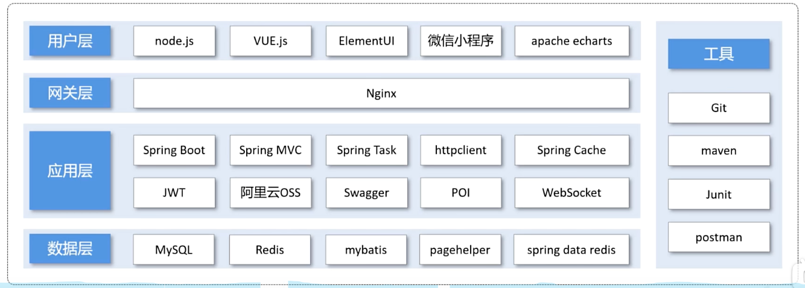


# API 

## API Design

- api design / frontend and backend development
  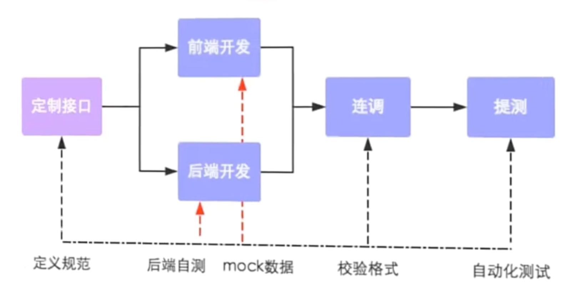

## API Manager

- Yapi

## API Testing

- Swagger

# Frontend

## How to start frontend project

- In mac os we don't run `nginx.exe` instead 
- run nginx: `sudo nginx -c /your/path/to/nginx.conf # run nginx` 

## Nginx

- debug

  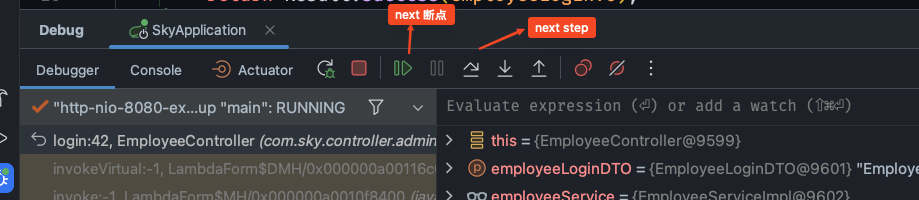

- Nginx reverse proxy

  - 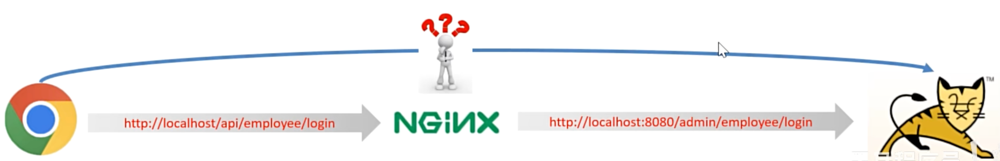
  - what is it?
    - request address in browser http://localhost/api/employee/login and in backend /admin/employee/login --> this is Nginx reverse proxy
    - browser doesn't and can't send request to backend directly, it should send to Nginx server first and Nginx server will forward it to the backend
    - ```nginx
      server {
        listen 80;
        server_name localhost;
        location /api/ {
          proxy_pass http://localhost:8080/admin/;
        }
      }
      ```
    - 
  - why use it?
    - make sure that browser can't visit backend server directly so server can be safe
    - when there are a lot request from frontend, Nginx server will help to send request to different server, lower the load of one server
    - some resource/static site will be stored in Nginx server and when you visit it again, no need to go to backend server, Nginx can response to that request directly

  - advantages

    - raise visit speed

    - load balancing (负载均衡)

      ```nginx
      upstream webservers {
      	  server 127.0.0.1:8080 weight=90 ;
      	  #server 127.0.0.1:8088 weight=10 ;
      }
      server {
        listen 80;
        server_name localhost;
        location /api/ {
          proxy_pass http://webservers/admin/;
        }
      }
      ```

      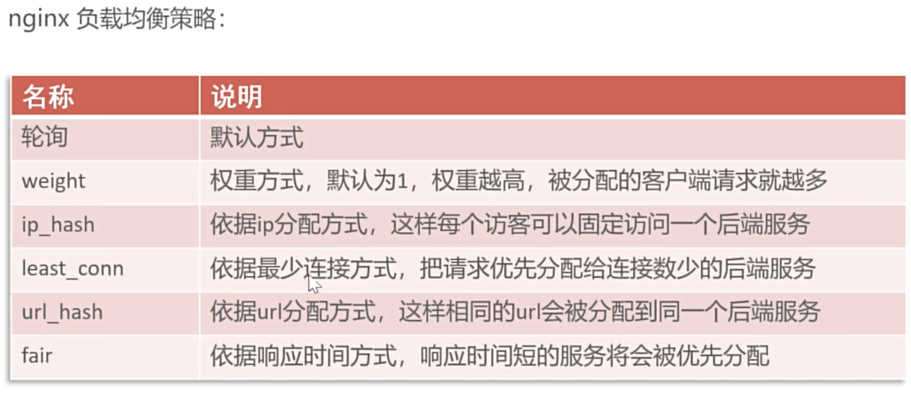

    - ensure security of backend server

    - 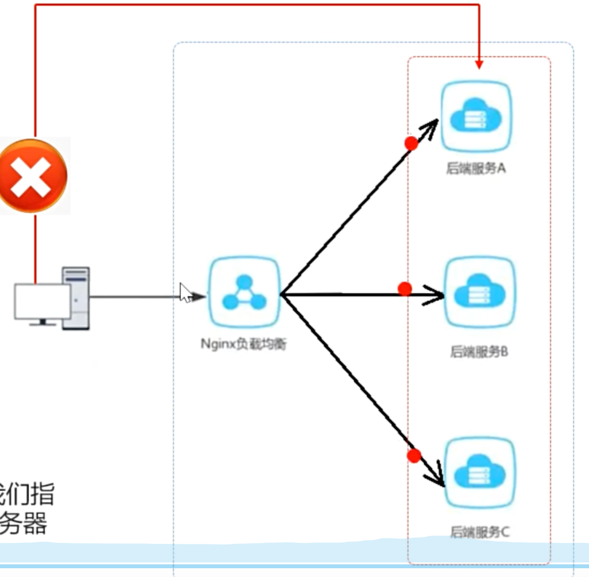

- Is nginx running correctly?

  - `ps aux | grep nginx` : will print out the running nginx information

- 是否在监听某个端口？ `lsof -i :4040` 

- test nginx conf: `sudo nginx -t -c /your/custom/path/nginx.conf`

- run nginx: `sudo nginx -c /Users/hurjiang/.../nginx.conf #启动nginx` 


# Database

- is designed and created already in `yummy_spicy.sql`
- 

# Backend

## Project structure

| number | modul name    | description                                                  |
| ------ | ------------- | ------------------------------------------------------------ |
| 1      | yummy-backend | maven father project, manage the dependencies for the whole project |
| 2      | yummy-common  | sub-modul for common classes, like: tool class, constant class, exception class and so on |
| 3      | yummy-pojo    | sub-modul for entity class, VO, DTO and so on                |
| 4      | yummy-server  | sub-modul for backend-server, contains dependencies files, Controller, Service, Mapper and so on |

### yummy-pojo

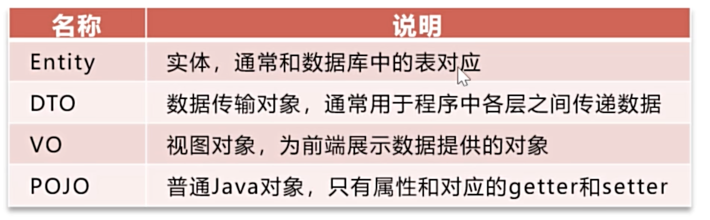

| Name                           | ..   |
| ------------------------------ | ---- |
| Entity                         |      |
| DTO (Data Transmission Object) |      |
| VO (View Data)                 |      |
| POJO ()                        |      |

## GlobalExceptionHandler

- a centralized mechanism that catches and handles unhandled or unexpected exceptions that occur anywhere in the application ==> it avoids writing repetitive try-catch block in multiple places

## Message converter of Spring MVC


## Add new employee

- Controller
  ```java
  @PostMapping
  @ApiOperation("Add new employee")
  public Result save(@RequestBody EmployeeDTO employeeDTO) {
      log.info("add new employee: {}", employeeDTO);
      employeeService.save(employeeDTO);
      return Result.success();
  }
  ```

- EmployeeServiceImpl
  ```java
  public void save(EmployeeDTO employeeDTO) {
  
  		Employee employee = new Employee();
      // object property copy
      BeanUtils.copyProperties(employeeDTO, employee);
      // set the rest properties
      employee.setStatus(StatusConstant.ENABLE);
      employee.setPassword(DigestUtils.md5DigestAsHex(PasswordConstant.DEFAULT_PASSWORD.getBytes()));
      employee.setCreateTime(LocalDateTime.now());
      employee.setUpdateTime(LocalDateTime.now());
      // #TODO: id of creator and editor
      employee.setCreateUser(10L);
      employee.setUpdateUser(10L);
  
      employeeMapper.insert(employee);
  }
  ```

  

- EmployeeMapper
  ```java
  @Insert("insert into employee (name, username, password, phone, sex, id_number, status, " +
              "create_time, update_time, create_user, update_user) " + "values " +
              "(#{name}, #{username}, #{password}, #{phone}, #{sex}, #{idNumber}, #{status}, " +
              "#{createTime}, #{updateTime}, #{createUser}, #{updateUser})")
      void insert(Employee employee);
  ```


### Exception handle for unique username

- `username` is unique in the database

- if you want to add another user with the existing username, you will get the following error: java.sql.SQLIntegrityConstraintViolationException: Duplicate entry 'jiang' for key 'employee.idx_username' 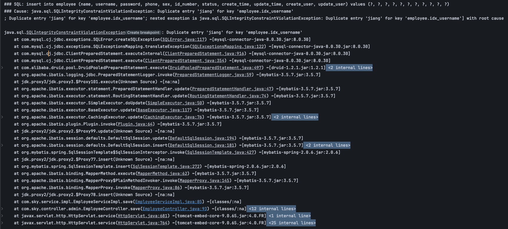

- Solution: handle the exception with GlobalExceptionHandler
  ```java
  @ExceptionHandler
  public Result exceptionHandler(SQLIntegrityConstraintViolationException ex){
      String message = ex.getMessage();
      if(message.contains("Duplicate entry")) {
          String[] split = message.split(" ");
          String username = split[2];
          String msg = username + MessageConstant.ALREADY_EXISTS;
          return Result.error(msg);
      } else {
          return Result.error(MessageConstant.UNKNOWN_ERROR);
      }
  }
  ```

  

### get/set creator/editor of new employee

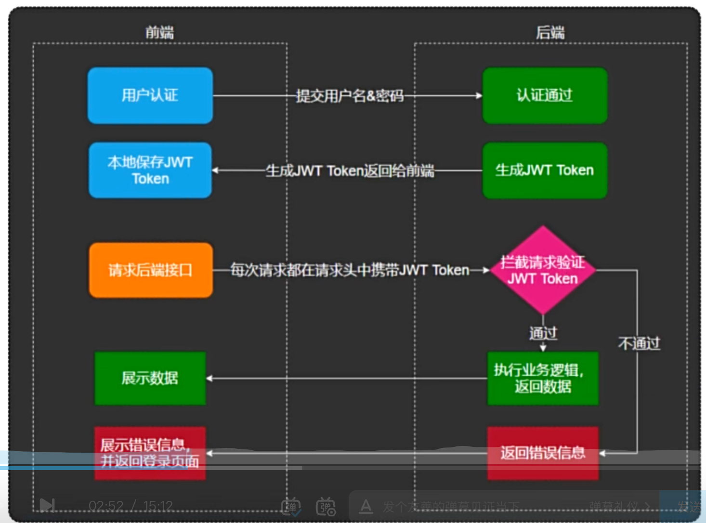

- Solution: ThreadLocal
  ```java
  public class BaseContext {
  
      public static ThreadLocal<Long> threadLocal = new ThreadLocal<>();
      public static void setCurrentId(Long id) {
          threadLocal.set(id);
      }
      public static Long getCurrentId() {
          return threadLocal.get();
      }
      public static void removeCurrentId() {
          threadLocal.remove();
      }
  }
  ```

- Encapsulate ThreadLocal in BaseContext //#TODO: What is ThreadLocal?

  - ThreadLocal: every current thread own the same storage?


## Employee page query

### PageHelper

### Frontend ==> Backend

- Frontend passes data to backend: `name`, `page`, `pageSize` 

- we use EmployeePageQueryDTO to encapsulate the data
  ```java
  public class EmployeePageQueryDTO implements Serializable {
    private String name;
    private int pageNumber;
    private int pageSize;
  }
  ```

- 

### Backend ==> Frontend

- `PageResult`: the result of page query will be encapsulated in this class

  ```java
  public class PageResult implements Serializable {
    private long total; // 
    private List records; // the data/employees of the current page
  }
  ```

  


## Change employee status

### pass current status through path

### mapper xml update

## Edit employee

### get employee by id

### update employee

## Category - add new category


## Category - page query

## Auto fill public field

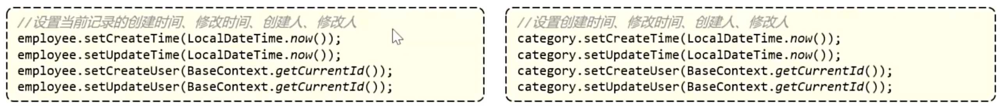

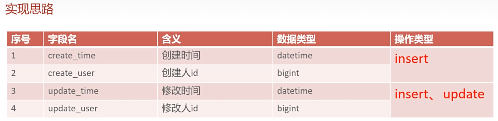

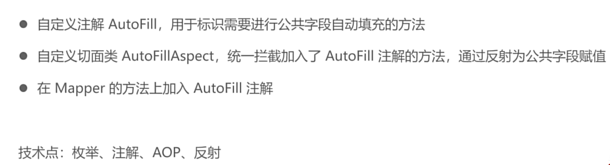

- enum
- annotation
- AOP
- reflection

### Annotation: AutoFill


### Enum: OperationType

