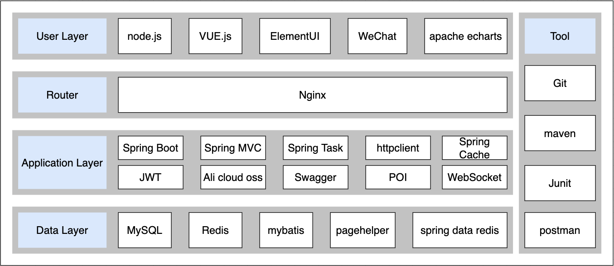

# User needs

# Stack

# Frontend

## How to start frontend project

- In mac os we don't run `nginx.exe` instead 
- run nginx: `sudo nginx -c /your/path/to/nginx.conf # run nginx` 

## Nginx

- debug

  

- Nginx reverse proxy

  - what is it?
    - request address in browser http://localhost/api/employee/login and in backend /admin/employee/login --> this is Nginx reverse proxy
    - browser doesn't and can't send request to backend directly, it should send to Nginx server first and Nginx server will forward it to the backend
  - why use it?
    - make sure that browser can't visit backend server directly so server can be safe
    - when there are a lot request from frontend, Nginx server will help to send request to different server, lower the load of one server
    - some resource/static site will be stored in Nginx server and when you visit it again, no need to go to backend server, Nginx can response to that request directly

- Is nginx running correctly?

  - `ps aux | grep nginx` : will print out the running nginx information
  
- 是否在监听某个端口？ `lsof -i :4040` 

- test nginx conf: `sudo nginx -t -c /your/custom/path/nginx.conf`

- run nginx: `sudo nginx -c /Users/hurjiang/.../nginx.conf #启动nginx` 

- 

# Database

- is designed and created already in `yummy_spicy.sql`

# Backend

## Project structure

| number | modul name    | description                                                  |
| ------ | ------------- | ------------------------------------------------------------ |
| 1      | yummy-backend | maven father project, manage the dependencies for the whole project |
| 2      | yummy-common  | sub-modul for common classes, like: tool class, constant class, exception class and so on |
| 3      | yummy-pojo    | sub-modul for entity class, VO, DTO and so on                |
| 4      | yummy-server  | sub-modul for backend-server, contains dependencies files, Controller, Service, Mapper and so on |

### yummy-pojo

| Name                           | ..   |
| ------------------------------ | ---- |
| Entity                         |      |
| DTO (Data Transmission Object) |      |
| VO (View Data)                 |      |
| POJO ()                        |      |

