# 📖 Table of Contents

## Project Intro

- [Project Introduction](#project-overview) 

## 🏗️ Project Setup

- [📋 Prerequisites](#prerequisites)
- [⚡ Quick Start](#quick-start)
- [🛠️ Installation Guide](#installation-guide)
- [🔧 Configuration](#configuration)

## 📚 Documentation

- [🚀 API Documentation](#api-documentation)
  - [🔐 Authentication](#authentication)
  - [👨‍💼 Admin APIs](#admin-apis)
  - [👤 User APIs](#user-apis)
  - [📄 Response Format](#response-format)
- [💾 Database Schema](#database)
  - [📊 ER Diagram](#table-relationships)
  - [🔧 Setup Instructions](#setup-instructions-1)
- [🎨 Frontend Guide](#frontend)
  - [🚀 Quick Start](#quick-start-1)
  - [🌐 Nginx Configuration](#nginx)

## 🏛️ Architecture & Implementation

- [🏗️ Backend Architecture](#backend)
  - [🔒 JWT Authentication System](#general-jwt-token-interceptors)
  - [👥 Employee Management](#admin-add-new-employee)
  - [🔐 WeChat Integration](#client-wechat-login)
- [🎯 Key Features](#key-features-implemented)
- [📈 Technical Highlights](#technical-highlights)

## 💡 Additional Resources

- [🗄️ Redis Integration](#redis)
- [🌐 HTTP Client Usage](#httpclient)
- [🐛 Troubleshooting](#troubleshooting)

---

# 📋 Prerequisites

Before running this application, ensure you have:

- **Java 8+** - Backend runtime environment
- **MySQL 5.7+** - Primary database
- **Redis** - Caching and session management
- **Node.js** - Frontend build tools (optional)
- **Nginx** - Reverse proxy and static file serving
- **WeChat Developer Account** - For mini-program integration

# ⚡ Quick Start

1. **Clone the repository**

   ```bash
   git clone https://github.com/your-username/yummy-spicy.git
   cd yummy-spicy
   ```

2. **Setup Database**

   ```bash
   mysql -u root -p < yummy-backend/yummy.sql
   ```

3. **Configure Application**

   ```bash
   # Copy and edit configuration
   cp application-dev.yml.example application-dev.yml
   # Update database and WeChat credentials
   ```

4. **Start Backend**

   ```bash
   cd yummy-backend
   mvn spring-boot:run
   ```

5. **Start Frontend**

   ```bash
   sudo nginx -c /path/to/nginx.conf
   ```

6. **Access Application**

   - Admin Dashboard: `http://localhost`
   - API Documentation: `http://localhost:8080/doc.html`
   - Default Login: `admin` / `123456`

# 🛠️ Installation Guide

## Backend Setup

1. **Build the project**

   ```bash
   cd yummy-backend
   mvn clean package
   ```

2. **Run the application**

   ```bash
   java -jar yummy-server/target/yummy-server-1.0.jar
   ```

## Frontend Setup

1. **Configure Nginx**

   ```nginx
   server {
       listen 80;
       server_name localhost;
       location /api/ {
           proxy_pass http://localhost:8080/admin/;
       }
   }
   ```

2. **Start Nginx**

   ```bash
   sudo nginx -c /path/to/your/nginx.conf
   ```


# 🔧 Configuration

## Database Configuration

```yaml
spring:
  datasource:
    url: jdbc:mysql://localhost:3306/yummy_spicy
    username: your_username
    password: your_password
```

## WeChat Mini Program

```yaml
yummy:
  wechat:
    appid: your_wechat_appid
    secret: your_wechat_secret
```

## JWT Settings

```yaml
yummy:
  jwt:
    admin-secret-key: your_admin_secret
    user-secret-key: your_user_secret
    admin-ttl: 72000000  # 20 hours
    user-ttl: 72000000   # 20 hours
```

---

# 🐛 Troubleshooting

## Common Issues

### Database Connection Failed

```bash
# Check MySQL service
sudo systemctl status mysql

# Verify credentials in application.yml
spring.datasource.username=your_username
spring.datasource.password=your_password
```

### Nginx Port Conflicts

```bash
# Check what's using port 80
sudo lsof -i :80

# Use alternative port in nginx.conf
listen 8080;
```

### JWT Token Issues

- Verify secret keys in configuration
- Check token expiration settings
- Ensure proper header format: `Bearer <token>`

### WeChat Integration Issues

- Verify WeChat appid and secret
- Check HTTPS requirements for production
- Validate authorization code format

# Yummy-Spicy Restaurant Management System

## Project Overview

**Yummy-Spicy** is a comprehensive full-stack restaurant management system built with modern web technologies. The project demonstrates enterprise-level software architecture, implementing both administrative management tools and customer-facing applications for a complete restaurant operations solution.

## Technical Architecture

### Backend (Spring Boot)
- **Framework**: Spring Boot 2.x with Maven multi-module architecture
- **Database**: MySQL with MyBatis ORM for data persistence
- **Authentication**: Dual JWT system (admin employees + WeChat users)
- **API Design**: RESTful APIs with comprehensive Swagger documentation
- **Security**: JWT interceptors, password encryption, input validation
- **Caching**: Redis for restaurant status and session management

### Frontend & Integration
- **Admin Panel**: Web-based dashboard for restaurant management
- **Customer Interface**: WeChat Mini Program for mobile ordering
- **Reverse Proxy**: Nginx for load balancing and static file serving
- **File Upload**: Local storage with OSS integration support

### Key Features Implemented

#### Admin Management System
- **Employee Management**: Complete CRUD operations with role-based access
- **Menu Management**: Dynamic dish and setmeal (combo) configuration
- **Category Management**: Hierarchical food category organization
- **Order Processing**: Real-time order tracking and status management
- **File Upload**: Image management for dishes and promotional content

#### Customer Experience
- **WeChat Integration**: Seamless login via WeChat Mini Program
- **Menu Browsing**: Real-time menu with availability status
- **Shopping Cart**: Persistent cart management across sessions
- **Order Management**: Order placement and tracking functionality

## Technical Highlights

### Advanced Spring Boot Features
- **AOP Integration**: Automatic field population for audit trails
- **Custom Interceptors**: JWT validation and request context management
- **Global Exception Handling**: Centralized error management
- **Dynamic SQL**: MyBatis XML for flexible database queries
- **Pagination**: Efficient PageHelper implementation for large datasets

### Database Design
- **11-table Schema**: Normalized design supporting complex business relationships
- **Dual Authentication**: Separate user systems for employees and customers
- **Audit Trails**: Comprehensive tracking of create/update operations
- **Flexible Menu System**: Support for individual dishes and combination meals

### Security & Performance
- **Stateless Authentication**: JWT tokens with configurable expiration
- **Password Security**: MD5 encryption with secure defaults
- **Thread Safety**: ThreadLocal for request context isolation
- **SQL Injection Prevention**: Parameterized queries throughout
- **Efficient Pagination**: Optimized database queries for large datasets

## Project Impact & Learning Outcomes

This project showcases expertise in:
- **Full-Stack Development**: End-to-end application development
- **Enterprise Architecture**: Scalable, maintainable code structure  
- **Database Design**: Complex relational database modeling
- **API Development**: RESTful service design and documentation
- **Security Implementation**: Authentication, authorization, and data protection
- **Third-Party Integration**: WeChat API integration for mobile payments
- **DevOps Practices**: Nginx configuration and deployment strategies

## Business Value

The system addresses real restaurant operational needs including staff management, inventory control, customer engagement, and order processing. The WeChat integration targets the Chinese market where WeChat Mini Programs are widely adopted for business applications.

---

*This project demonstrates advanced Spring Boot development skills, database design expertise, and the ability to integrate complex business requirements into a cohesive technical solution.*

---

# Tech Stack


# API Documentation

## API Design Philosophy

The API follows RESTful design principles with clear separation between admin and user endpoints:

- **Admin APIs** (`/admin/**`): Full CRUD operations for restaurant management
- **User APIs** (`/user/**`): Read-only operations for customers browsing menu
- **Consistent Response Format**: All endpoints return `Result<T>` wrapper
- **JWT Authentication**: Separate token validation for admin and user access


## API Tools

- **API Manager**: Yapi for API specification management
- **API Testing**: Swagger UI for interactive testing at `/doc.html`
- **Documentation**: Auto-generated using Knife4j

## Admin APIs

### Employee Management (`/admin/employee`)

| Method | Endpoint | Description | Request | Response |
|--------|----------|-------------|---------|----------|
| `POST` | `/login` | Employee login | `EmployeeLoginDTO` | `Result<EmployeeLoginVO>` |
| `POST` | `/logout` | Employee logout | - | `Result<String>` |
| `POST` | `/` | Add new employee | `EmployeeDTO` | `Result` |
| `GET` | `/page` | Employee pagination | Query params | `Result<PageResult>` |
| `POST` | `/status/{status}` | Update employee status | Path + Query | `Result` |
| `GET` | `/{id}` | Get employee by ID | Path variable | `Result<Employee>` |
| `PUT` | `/` | Update employee | `EmployeeDTO` | `Result` |

**Example Request - Employee Login:**
```json
POST /admin/employee/login
{
  "username": "admin",
  "password": "123456"
}
```

**Example Response:**
```json
{
  "code": 1,
  "msg": null,
  "data": {
    "id": 1,
    "userName": "admin",
    "name": "Administrator",
    "token": "eyJhbGciOiJIUzI1NiJ9..."
  }
}
```

### Category Management (`/admin/category`)

| Method | Endpoint | Description | Request | Response |
|--------|----------|-------------|---------|----------|
| `POST` | `/` | Add new category | `CategoryDTO` | `Result<String>` |
| `GET` | `/page` | Category pagination | Query params | `Result<PageResult>` |
| `PUT` | `/` | Update category | `CategoryDTO` | `Result<String>` |
| `POST` | `/status/{status}` | Update category status | Path + Query | `Result<String>` |
| `DELETE` | `/` | Delete category | Query param | `Result<String>` |
| `GET` | `/list` | List categories by type | Query param | `Result<List<Category>>` |

### Dish Management (`/admin/dish`)

| Method | Endpoint | Description | Request | Response |
|--------|----------|-------------|---------|----------|
| `POST` | `/` | Add new dish | `DishDTO` | `Result` |
| `GET` | `/page` | Dish pagination | Query params | `Result<PageResult>` |
| `DELETE` | `/` | Delete dishes (batch) | `List<Long> ids` | `Result` |
| `GET` | `/{id}` | Get dish by ID | Path variable | `Result<DishVO>` |
| `PUT` | `/` | Update dish | `DishDTO` | `Result` |
| `GET` | `/list` | List dishes by category | Query param | `Result<List<Dish>>` |

### Setmeal Management (`/admin/setmeal`)

| Method | Endpoint | Description | Request | Response |
|--------|----------|-------------|---------|----------|
| `POST` | `/` | Add new setmeal | `SetmealDTO` | `Result` |
| `GET` | `/page` | Setmeal pagination | Query params | `Result<PageResult>` |
| `DELETE` | `/` | Delete setmeals (batch) | `List<Long> ids` | `Result` |
| `GET` | `/{id}` | Get setmeal by ID | Path variable | `Result<SetmealVO>` |
| `PUT` | `/` | Update setmeal | `SetmealDTO` | `Result` |
| `POST` | `/status/{status}` | Update setmeal status | Path + Query | `Result` |

### File Upload (`/admin/common`)

| Method | Endpoint | Description | Request | Response |
|--------|----------|-------------|---------|----------|
| `POST` | `/upload` | Upload files locally | `MultipartFile` | `Result<String>` |
| `POST` | `/ossupload` | Upload files to OSS | `MultipartFile` | `Result<String>` |

### Restaurant Status (`/admin/shop`)

| Method | Endpoint | Description | Request | Response |
|--------|----------|-------------|---------|----------|
| `PUT` | `/{status}` | Set restaurant status | Path variable | `Result` |
| `GET` | `/status` | Get restaurant status | - | `Result<Integer>` |

## User APIs

### User Authentication (`/user/user`)

| Method | Endpoint | Description | Request | Response |
|--------|----------|-------------|---------|----------|
| `POST` | `/login` | WeChat login | `UserLoginDTO` | `Result<UserLoginVO>` |

**Example Request - WeChat Login:**
```json
POST /user/user/login
{
  "code": "WeChat_authorization_code_from_wx.login()"
}
```

**Example Response:**
```json
{
  "code": 1,
  "msg": null,
  "data": {
    "id": 1,
    "openid": "oMgZeweKSuODzH3JlD3z8Vx1uT8s",
    "token": "eyJhbGciOiJIUzI1NiJ9..."
  }
}
```

### Category Browsing (`/user/category`)

| Method | Endpoint | Description | Request | Response |
|--------|----------|-------------|---------|----------|
| `GET` | `/list` | Browse categories | `type` (query) | `Result<List<Category>>` |

### Dish Browsing (`/user/dish`)

| Method | Endpoint | Description | Request | Response |
|--------|----------|-------------|---------|----------|
| `GET` | `/list` | Browse dishes by category | `categoryId` (query) | `Result<List<DishVO>>` |

### Setmeal Browsing (`/user/setmeal`)

| Method | Endpoint | Description | Request | Response |
|--------|----------|-------------|---------|----------|
| `GET` | `/list` | Browse setmeals by category | `categoryId` (query) | `Result<List<Setmeal>>` |
| `GET` | `/dish/{id}` | Get dishes in setmeal | Path variable | `Result<List<DishItemVO>>` |

### Restaurant Status (`/user/shop`)

| Method | Endpoint | Description | Request | Response |
|--------|----------|-------------|---------|----------|
| `GET` | `/status` | Check restaurant status | - | `Result<Integer>` |

## Response Format

All APIs use a consistent response wrapper:

```json
{
  "code": 1,        // 1: success, 0: failure
  "msg": "string",  // Error message (null on success)
  "data": {}        // Response data (null on failure)
}
```

### Success Response
```json
{
  "code": 1,
  "msg": null,
  "data": {
    // Actual response data
  }
}
```

### Error Response
```json
{
  "code": 0,
  "msg": "Error description",
  "data": null
}
```

## Authentication

### Admin Authentication
- **Header**: `token`
- **Format**: `Bearer <JWT_TOKEN>`
- **Scope**: All `/admin/**` endpoints except `/admin/employee/login`

### User Authentication
- **Header**: `authentication` 
- **Format**: `Bearer <JWT_TOKEN>`
- **Scope**: All `/user/**` endpoints except `/user/user/login` and `/user/shop/status`

## Common Status Codes

| Code | Description |
|------|-------------|
| `200` | Success |
| `400` | Bad Request - Invalid parameters |
| `401` | Unauthorized - Invalid or missing token |
| `403` | Forbidden - Insufficient permissions |
| `404` | Not Found - Resource doesn't exist |
| `500` | Internal Server Error |

## Pagination

List endpoints support pagination with these query parameters:

- `page`: Page number (starting from 1)
- `pageSize`: Number of items per page
- `name`: Optional search filter

**Example Pagination Request:**
```
GET /admin/employee/page?page=1&pageSize=10&name=john
```

**Example Pagination Response:**
```json
{
  "code": 1,
  "msg": null,
  "data": {
    "total": 25,
    "records": [
      // Array of items for current page
    ]
  }
}
```

# Frontend

## Project Structure

The frontend consists of:
- **Admin Web Interface**: Restaurant management dashboard
- **WeChat Mini Program**: Customer ordering interface  
- **Nginx Server**: Reverse proxy and static file serving

## Quick Start

### Running the Frontend (macOS)

1. **Start Nginx**:
   ```bash
   sudo nginx -c /your/path/to/nginx.conf
   ```

2. **Access Application**:
   - Admin Dashboard: `http://localhost`
   - API Base URL: `http://localhost/api/` 

## Nginx

- debug

  

- Nginx reverse proxy

  - 
  - what is it?
    - request address in browser http://localhost/api/employee/login and in backend /admin/employee/login --> this is Nginx reverse proxy
    - browser doesn't and can't send request to backend directly, it should send to Nginx server first and Nginx server will forward it to the backend
    - ```nginx
      server {
        listen 80;
        server_name localhost;
        location /api/ {
          proxy_pass http://localhost:8080/admin/;
        }
      }
      ```
    - 
  - why use it?
    - make sure that browser can't visit backend server directly so server can be safe
    - when there are a lot request from frontend, Nginx server will help to send request to different server, lower the load of one server
    - some resource/static site will be stored in Nginx server and when you visit it again, no need to go to backend server, Nginx can response to that request directly

  - advantages

    - raise visit speed

    - load balancing (负载均衡)

      ```nginx
      upstream webservers {
      	  server 127.0.0.1:8080 weight=90 ;
      	  #server 127.0.0.1:8088 weight=10 ;
      }
      server {
        listen 80;
        server_name localhost;
        location /api/ {
          proxy_pass http://webservers/admin/;
        }
      }
      ```

      

    - ensure security of backend server

    - 

- Is nginx running correctly?

  - `ps aux | grep nginx` : will print out the running nginx information

## Nginx Management

### Development Commands

- **Check running status**: `ps aux | grep nginx`
- **Check port listening**: `lsof -i :80` (replace 80 with your port)
- **Test configuration**: `sudo nginx -t -c /your/custom/path/nginx.conf`
- **Start server**: `sudo nginx -c /your/path/to/nginx.conf`
- **Reload configuration**: `sudo nginx -s reload`
- **Stop server**: `sudo nginx -s stop`

### Troubleshooting

- **Port conflicts**: Use `lsof -i :PORT` to check what's using a specific port
- **Configuration errors**: Run `sudo nginx -t` to validate config syntax
- **Permission issues**: Ensure proper file permissions for config and web root directories 


# Database

## Overview

The yummy-spicy restaurant management system uses **MySQL** as its primary database. The complete database schema is defined in `yummy.sql` and includes 11 tables supporting restaurant operations from menu management to order processing.

## Database Schema

### Core Tables

#### 1. User Management
- **`employee`** - Admin staff information and authentication
- **`user`** - WeChat customer profiles and authentication

#### 2. Menu System  
- **`category`** - Food categories (dishes/setmeals)
- **`dish`** - Individual dishes with pricing and descriptions
- **`dish_flavor`** - Customizable flavor options for dishes
- **`setmeal`** - Meal packages/combos
- **`setmeal_dish`** - Many-to-many relationship between setmeals and dishes

#### 3. Order Management
- **`orders`** - Customer orders with payment and delivery info
- **`order_detail`** - Line items for each order
- **`shopping_cart`** - Temporary cart storage for users
- **`address_book`** - Customer delivery addresses

## Table Relationships

```mermaid
erDiagram
    USER ||--o{ ORDERS : places
    USER ||--o{ SHOPPING_CART : owns
    USER ||--o{ ADDRESS_BOOK : has
    
    EMPLOYEE ||--o{ CATEGORY : creates
    EMPLOYEE ||--o{ DISH : manages
    EMPLOYEE ||--o{ SETMEAL : manages
    
    CATEGORY ||--o{ DISH : contains
    CATEGORY ||--o{ SETMEAL : contains
    
    DISH ||--o{ DISH_FLAVOR : has
    DISH ||--o{ SETMEAL_DISH : "part of"
    DISH ||--o{ ORDER_DETAIL : "ordered as"
    DISH ||--o{ SHOPPING_CART : "added to"
    
    SETMEAL ||--o{ SETMEAL_DISH : includes
    SETMEAL ||--o{ ORDER_DETAIL : "ordered as"
    SETMEAL ||--o{ SHOPPING_CART : "added to"
    
    ORDERS ||--o{ ORDER_DETAIL : contains
    ADDRESS_BOOK ||--o{ ORDERS : "delivers to"
    
    USER {
        bigint id PK
        varchar openid
        varchar name
        varchar phone
        datetime create_time
    }
    
    EMPLOYEE {
        bigint id PK
        varchar username UK
        varchar password
        varchar name
        varchar phone
        int status
    }
    
    CATEGORY {
        bigint id PK
        varchar name UK
        int type
        int sort
        int status
    }
    
    DISH {
        bigint id PK
        varchar name UK
        bigint category_id FK
        decimal price
        varchar image
        int status
    }
    
    SETMEAL {
        bigint id PK
        varchar name UK
        bigint category_id FK
        decimal price
        int status
    }
    
    ORDERS {
        bigint id PK
        varchar number
        bigint user_id FK
        int status
        decimal amount
        datetime order_time
    }
```



## Key Features

### 1. **Dual Authentication System**
- **Employee Table**: Username/password authentication for admin staff
- **User Table**: WeChat OpenID authentication for customers

### 2. **Flexible Menu Structure**
- **Categories**: Support both dish categories (type=1) and setmeal categories (type=2)
- **Dishes**: Individual menu items with customizable flavors
- **Setmeals**: Package deals containing multiple dishes

### 3. **Comprehensive Order Management**
- **Shopping Cart**: Temporary storage before checkout
- **Orders**: Complete order lifecycle with status tracking
- **Order Details**: Line-by-line breakdown of items ordered

### 4. **Address Management**
- **Address Book**: Multiple delivery addresses per user
- **Default Address**: Automatic selection for faster checkout

## Common Status Values

### Dish/Setmeal Status
- `0`: Disabled/Out of Stock
- `1`: Enabled/Available

### Order Status
- `1`: Pending Payment
- `2`: Pending Confirmation
- `3`: Confirmed
- `4`: In Delivery
- `5`: Completed
- `6`: Cancelled
- `7`: Refunded

### Payment Status
- `0`: Unpaid
- `1`: Paid
- `2`: Refunded

## Database Configuration

### Connection Settings
```yaml
spring:
  datasource:
    url: jdbc:mysql://localhost:3306/yummy_spicy
    username: ${DB_USERNAME:root}
    password: ${DB_PASSWORD:password}
    driver-class-name: com.mysql.cj.jdbc.Driver
```

### MyBatis Configuration
```yaml
mybatis:
  mapper-locations: classpath:mapper/*.xml
  type-aliases-package: com.yummy.entity
  configuration:
    map-underscore-to-camel-case: true
```

## Setup Instructions

### 1. **Database Creation**
```bash
mysql -u root -p < yummy-backend/yummy.sql
```

### 2. **Verify Installation** 
```sql
USE yummy_spicy;
SHOW TABLES;
SELECT COUNT(*) FROM category;  -- Should return sample data
```

### 3. **Default Admin Account**
- **Username**:
- **Password**: 
- **ID**: `1`

## Performance Considerations

### Indexes
- **Unique Constraints**: `username`, `dish.name`, `category.name`, `setmeal.name`
- **Foreign Keys**: Automatic indexing on relationship columns
- **Custom Indexes**: Consider adding indexes on frequently queried columns

### Data Storage
- **Images**: Stored as URLs pointing to external storage (OSS/local)
- **JSON Data**: Flavor options stored as JSON strings in `dish_flavor.value`
- **Timestamps**: Automatic tracking of create/update times

## Backup and Maintenance

### Regular Backups
```bash
mysqldump -u root -p yummy_spicy > backup_$(date +%Y%m%d).sql
```

### Database Monitoring
- Monitor connection pool usage
- Track slow query logs
- Regular index optimization

# Backend

## Project structure

| number | modul name    | description                                                  |
| ------ | ------------- | ------------------------------------------------------------ |
| 1      | yummy-backend | maven father project, manage the dependencies for the whole project |
| 2      | yummy-common  | sub-modul for common classes, like: tool class, constant class, exception class and so on |
| 3      | yummy-pojo    | sub-modul for entity class, VO, DTO and so on                |
| 4      | yummy-server  | sub-modul for backend-server, contains dependencies files, Controller, Service, Mapper and so on |

### yummy-pojo


| Name                           | ..   |
| ------------------------------ | ---- |
| Entity                         |      |
| DTO (Data Transmission Object) |      |
| VO (View Data)                 |      |
| POJO ()                        |      |

## General: GlobalExceptionHandler

- a centralized mechanism that catches and handles unhandled or unexpected exceptions that occur anywhere in the application ==> it avoids writing repetitive try-catch block in multiple places

## General: Message converter of Spring MVC

## General: JWT Token Interceptors

The application uses Spring MVC interceptors to validate JWT tokens for both admin employees and WeChat users. These interceptors provide automatic authentication and authorization for protected endpoints.

### Overview

The system implements **dual JWT authentication** with separate interceptors:

1. **JwtTokenAdminInterceptor** - For admin employee authentication
2. **JwtTokenUserInterceptor** - For WeChat user authentication

### Architecture


### Admin JWT Interceptor

#### Purpose

Validates JWT tokens for admin employee requests to ensure only authenticated employees can access admin functionality.

#### Configuration

- **Path Patterns**: `/admin/**`
- **Exclusions**: `/admin/employee/login`
- **Token Header**: `"token"`
- **Secret Key**: `adminSecretKey`
- **Claim**: `EMP_ID`

#### Implementation Details

```java
@Component
public class JwtTokenAdminInterceptor implements HandlerInterceptor {
    
    public boolean preHandle(HttpServletRequest request, 
                           HttpServletResponse response, 
                           Object handler) throws Exception {
        
        // 1. Extract token from "token" header
        String token = request.getHeader(jwtProperties.getAdminTokenName());
        
        // 2. Validate token with admin secret key
        Claims claims = JwtUtil.parseJWT(jwtProperties.getAdminSecretKey(), token);
        
        // 3. Extract employee ID from claims
        Long empId = Long.valueOf(claims.get(JwtClaimsConstant.EMP_ID).toString());
        
        // 4. Store in thread local context
        BaseContext.setCurrentId(empId);
        
        return true; // Allow request to proceed
    }
}
```

#### Request Flow

```
Admin Login → JWT Token → Request with "token" header → 
Admin Interceptor → Validation → Employee ID in Context → Admin Controller
```

### User JWT Interceptor

#### Purpose

Validates JWT tokens for WeChat user requests to ensure only authenticated users can access user-specific functionality.

#### Configuration

- **Path Patterns**: `/user/**`
- **Exclusions**: `/user/login`
- **Token Header**: `"authentication"`
- **Secret Key**: `userSecretKey`
- **Claim**: `USER_ID`

#### Implementation Details

```java
@Component
public class JwtTokenUserInterceptor implements HandlerInterceptor {
    
    public boolean preHandle(HttpServletRequest request, 
                           HttpServletResponse response, 
                           Object handler) throws Exception {
        
        // 1. Extract token from "authentication" header
        String token = request.getHeader(jwtProperties.getUserTokenName());
        
        // 2. Validate token with user secret key
        Claims claims = JwtUtil.parseJWT(jwtProperties.getUserSecretKey(), token);
        
        // 3. Extract user ID from claims
        Long userId = Long.valueOf(claims.get(JwtClaimsConstant.USER_ID).toString());
        
        // 4. Store in thread local context
        BaseContext.setCurrentId(userId);
        
        return true; // Allow request to proceed
    }
}
```

#### Request Flow

```
WeChat Login → JWT Token → Request with "authentication" header → 
User Interceptor → Validation → User ID in Context → User Controller
```

### Interceptor Comparison

| Feature             | Admin Interceptor       | User Interceptor   |
| ------------------- | ----------------------- | ------------------ |
| **Target Users**    | Admin employees         | WeChat users       |
| **Path Pattern**    | `/admin/**`             | `/user/**`         |
| **Excluded Paths**  | `/admin/employee/login` | `/user/login`      |
| **Token Header**    | `"token"`               | `"authentication"` |
| **Secret Key**      | `adminSecretKey`        | `userSecretKey`    |
| **JWT Claim**       | `EMP_ID`                | `USER_ID`          |
| **Token TTL**       | 20 hours                | 20 hours           |
| **Context Storage** | Employee ID             | User ID            |

### Registration in WebMvcConfiguration

```java
@Configuration
public class WebMvcConfiguration extends WebMvcConfigurationSupport {
    
    @Autowired
    private JwtTokenAdminInterceptor jwtTokenAdminInterceptor;
    @Autowired
    private JwtTokenUserInterceptor jwtTokenUserInterceptor;
    
    @Override
    protected void addInterceptors(InterceptorRegistry registry) {
        // Register admin JWT interceptor
        registry.addInterceptor(jwtTokenAdminInterceptor)
                .addPathPatterns("/admin/**")
                .excludePathPatterns("/admin/employee/login");
        
        // Register user JWT interceptor
        registry.addInterceptor(jwtTokenUserInterceptor)
                .addPathPatterns("/user/**")
                .excludePathPatterns("/user/login");
    }
}
```

### BaseContext ThreadLocal

Both interceptors use `BaseContext` to store the authenticated user/employee ID in thread-local storage:

```java
public class BaseContext {
    private static ThreadLocal<Long> threadLocal = new ThreadLocal<>();
    
    public static void setCurrentId(Long id) {
        threadLocal.set(id);
    }
    
    public static Long getCurrentId() {
        return threadLocal.get();
    }
    
    public static void removeCurrentId() {
        threadLocal.remove();
    }
}
```

#### Usage in Controllers

```java
// In any controller method after interceptor validation
Long currentUserId = BaseContext.getCurrentId();
Long currentEmployeeId = BaseContext.getCurrentId();
```

### Error Handling

Both interceptors handle authentication failures consistently:

#### Invalid Token Scenarios

- **Missing Token**: No token in request header
- **Malformed Token**: Invalid JWT format
- **Expired Token**: Token past expiration time
- **Invalid Signature**: Token signature verification fails
- **Wrong Secret**: Token signed with different secret key

#### Error Response

```http
HTTP/1.1 401 Unauthorized
Content-Length: 0
```

### Security Features

#### 1. **Automatic Protection**

- All protected endpoints require valid JWT tokens
- No manual token validation needed in controllers
- Consistent security across the application

#### 2. **Stateless Authentication**

- No server-side session storage required
- Tokens contain all necessary authentication information
- Horizontal scaling friendly

#### 3. **Role Separation**

- Clear separation between admin and user tokens
- Different secret keys prevent token cross-usage
- Isolated authentication domains

#### 4. **Request Context**

- Authenticated user/employee ID available throughout request
- Stored in thread-local storage for thread safety
- Automatic cleanup after request completion

#### 5. **Fail-Safe Design**

- Invalid tokens immediately rejected
- Clear error responses for debugging
- Comprehensive logging for security monitoring

### Testing with Swagger

#### Admin Endpoints

1. Login via `/admin/employee/login` to get admin token
2. Use "Authorize" button in Swagger UI
3. Enter token in "token" field
4. Test protected admin endpoints

#### User Endpoints

1. Login via `/user/login` to get user token
2. Use "Authorize" button in Swagger UI
3. Enter token in "authentication" field
4. Test protected user endpoints

### Best Practices

1. **Token Storage**: Store tokens securely on client side
2. **Token Refresh**: Implement token refresh mechanism for long sessions
3. **Logout**: Clear tokens on client logout
4. **HTTPS**: Always use HTTPS in production
5. **Monitoring**: Log authentication failures for security analysis

## Admin: Add New Employee

### Overview

The add employee feature allows administrators to register new staff members in the system. It implements proper data validation, password security, and automatic field population using Spring Boot best practices.

### API Endpoint

**POST** `/admin/employee`

**Request Body** (`EmployeeDTO`):
```json
{
  "name": "John Smith",
  "username": "john.smith",
  "phone": "13812345678",
  "sex": "1",
  "idNumber": "110101199001010001"
}
```

**Response**:
```json
{
  "code": 1,
  "msg": null,
  "data": null
}
```

### Implementation Architecture

#### 1. Controller Layer (`EmployeeController.java`)

```java
@PostMapping
@ApiOperation("Add new employee")
public Result save(@RequestBody EmployeeDTO employeeDTO) {
    log.info("add new employee: {}", employeeDTO);
    employeeService.save(employeeDTO);
    return Result.success();
}
```

**Key Features**:
- Uses `@RequestBody` for JSON data binding
- Comprehensive logging for audit trails
- Returns standardized `Result` wrapper

#### 2. Service Layer (`EmployeeServiceImpl.java`)

```java
@AutoFill(value = OperationType.INSERT)
public void save(EmployeeDTO employeeDTO) {
    Employee employee = new Employee();
    
    // Copy properties from DTO to Entity
    BeanUtils.copyProperties(employeeDTO, employee);
    
    // Set default values
    employee.setStatus(StatusConstant.ENABLE);
    employee.setPassword(DigestUtils.md5DigestAsHex(
        PasswordConstant.DEFAULT_PASSWORD.getBytes()));
    
    // Timestamp and user tracking handled by @AutoFill
    employeeMapper.insert(employee);
}
```

**Key Features**:
- **Data Transfer**: Uses `BeanUtils.copyProperties()` for DTO to Entity conversion
- **Password Security**: MD5 encryption with default password "123456"
- **Status Management**: All new employees enabled by default
- **Auto-fill Integration**: Automatic timestamp and user ID population

#### 3. Data Access Layer (`EmployeeMapper.java`)

```java
@AutoFill(value = OperationType.INSERT)
@Insert("insert into employee (name, username, password, phone, sex, id_number, status, " +
        "create_time, update_time, create_user, update_user) values " +
        "(#{name}, #{username}, #{password}, #{phone}, #{sex}, #{idNumber}, #{status}, " +
        "#{createTime}, #{updateTime}, #{createUser}, #{updateUser})")
void insert(Employee employee);
```

**Key Features**:
- **MyBatis Annotations**: Direct SQL execution with parameter binding
- **Auto-fill Support**: `@AutoFill` annotation triggers AOP for metadata fields
- **Parameter Mapping**: Uses `#{}` syntax for safe parameter substitution

### Error Handling

#### Unique Username Constraint

**Problem**: Database constraint violation when duplicate usernames are inserted.

**Error Example**:
```
java.sql.SQLIntegrityConstraintViolationException: 
Duplicate entry 'john.smith' for key 'employee.idx_username'
```


**Solution** - Global Exception Handler:

```java
@ExceptionHandler
public Result exceptionHandler(SQLIntegrityConstraintViolationException ex) {
    String message = ex.getMessage();
    if (message.contains("Duplicate entry")) {
        String[] split = message.split(" ");
        String username = split[2];
        String msg = username + MessageConstant.ALREADY_EXISTS;
        return Result.error(msg);
    } else {
        return Result.error(MessageConstant.UNKNOWN_ERROR);
    }
}
```

**Benefits**:
- Centralized error handling across the application
- User-friendly error messages
- Consistent error response format

### Auto-fill Metadata Fields

**Challenge**: Tracking who created/updated records and when.


**Solution** - ThreadLocal with AOP:

```java
public class BaseContext {
    private static ThreadLocal<Long> threadLocal = new ThreadLocal<>();
    
    public static void setCurrentId(Long id) {
        threadLocal.set(id);
    }
    
    public static Long getCurrentId() {
        return threadLocal.get();
    }
    
    public static void removeCurrentId() {
        threadLocal.remove();
    }
}
```

**How It Works**:
1. **JWT Interceptor** extracts employee ID from token and stores in ThreadLocal
2. **@AutoFill AOP** reads current user ID and populates metadata fields
3. **Thread Safety** ensures each request has isolated context

**ThreadLocal Benefits**:
- **Thread Isolation**: Each HTTP request runs in its own thread
- **Automatic Cleanup**: ThreadLocal cleared after request completion
- **No Parameter Passing**: Eliminates need to pass user ID through all layers

### Data Transfer Objects

#### EmployeeDTO (Request)
```java
@Data
public class EmployeeDTO implements Serializable {
    private Long id;           // Optional for updates
    private String username;   // Unique identifier
    private String name;       // Display name
    private String phone;      // Contact number
    private String sex;        // Gender (1=male, 0=female)
    private String idNumber;   // National ID number
}
```

#### Employee Entity (Database)
```java
@Data
@Builder
@NoArgsConstructor
@AllArgsConstructor
public class Employee implements Serializable {
    private Long id;                    // Primary key
    private String username;            // Login username
    private String name;               // Full name
    private String password;           // Encrypted password
    private String phone;              // Phone number
    private String sex;                // Gender
    private String idNumber;           // ID number
    private Integer status;            // 0=disabled, 1=enabled
    private LocalDateTime createTime;  // Creation timestamp
    private LocalDateTime updateTime;  // Last update timestamp
    private Long createUser;           // Creator's employee ID
    private Long updateUser;           // Last updater's employee ID
}
```

### Security Features

1. **Password Encryption**: MD5 hash with default password "123456"
2. **Input Validation**: Bean validation on DTO fields
3. **SQL Injection Prevention**: MyBatis parameter binding
4. **Audit Trail**: Automatic tracking of creation metadata
5. **Authorization**: JWT token required for access

### Testing with Swagger

1. Navigate to `/doc.html`
2. Find "admin employee management" → `POST /admin/employee`
3. Use admin token for authorization
4. Sample test payload:
```json
{
  "name": "Test Employee",
  "username": "test.employee",
  "phone": "13800138000",
  "sex": "1",
  "idNumber": "110101199001010002"
}
```

## Admin: Employee Page Query

### Overview

The employee page query feature provides paginated listing of employees with optional name-based filtering. It uses MyBatis PageHelper for efficient database pagination and supports dynamic search criteria.

### API Endpoint

**GET** `/admin/employee/page?page=1&pageSize=10&name=john`

**Query Parameters**:
- `page`: Page number (starting from 1)
- `pageSize`: Number of records per page
- `name`: Optional name filter (partial match)

**Response**:
```json
{
  "code": 1,
  "msg": null,
  "data": {
    "total": 25,
    "records": [
      {
        "id": 1,
        "username": "admin",
        "name": "Administrator",
        "phone": "13812312312",
        "sex": "1",
        "idNumber": "110101199001010047",
        "status": 1,
        "createTime": "2022-02-15T15:51:20",
        "updateTime": "2022-02-17T09:16:20",
        "createUser": 10,
        "updateUser": 1
      }
    ]
  }
}
```

### Implementation Architecture

#### 1. Controller Layer

```java
@GetMapping("/page")
@ApiOperation("Employee page query")
public Result<PageResult> pageQuery(EmployeePageQueryDTO employeePageQueryDTO) {
    log.info("employee page query: {}", employeePageQueryDTO);
    PageResult pageResult = employeeService.pageQuery(employeePageQueryDTO);
    return Result.success(pageResult);
}
```

**Key Features**:
- **Query Parameter Binding**: Automatic binding to DTO
- **Generic Response**: `Result<PageResult>` for type safety
- **Request Logging**: Comprehensive audit trail

#### 2. Service Layer

```java
public PageResult pageQuery(EmployeePageQueryDTO employeePageQueryDTO) {
    // Configure pagination using PageHelper
    PageHelper.startPage(employeePageQueryDTO.getPage(), 
                         employeePageQueryDTO.getPageSize());
    
    // Execute query - PageHelper intercepts and adds LIMIT clause
    Page<Employee> page = employeeMapper.pageQuery(employeePageQueryDTO);
    
    // Extract pagination results
    long total = page.getTotal();
    List<Employee> records = page.getResult();
    
    return new PageResult(total, records);
}
```

**PageHelper Workflow**:
1. **ThreadLocal Configuration**: `PageHelper.startPage()` sets pagination parameters
2. **Query Interception**: MyBatis plugin intercepts next query
3. **SQL Modification**: Automatically adds `LIMIT` and `COUNT` clauses
4. **Result Extraction**: Returns wrapped `Page<T>` with metadata

#### 3. Data Access Layer

**Mapper Interface**:
```java
Page<Employee> pageQuery(EmployeePageQueryDTO employeePageQueryDTO);
```

**MyBatis XML**:
```xml
<select id="pageQuery" resultType="com.yummy.entity.Employee">
    select * from employee
    <where>
        <if test="name != null and name != ''">
            and name like concat('%', #{name}, '%')
        </if>
    </where>
    order by create_time desc
</select>
```

**Dynamic SQL Features**:
- **Conditional WHERE**: Only applies name filter if provided
- **LIKE Search**: Partial matching with `%` wildcards
- **Default Ordering**: Most recent employees first
- **SQL Injection Safe**: MyBatis parameter binding

### Data Transfer Objects

#### EmployeePageQueryDTO (Request)
```java
@Data
public class EmployeePageQueryDTO implements Serializable {
    private String name;     // Optional search filter
    private int page;        // Page number (1-based)
    private int pageSize;    // Records per page
}
```

#### PageResult (Response)
```java
@Data
@AllArgsConstructor
@NoArgsConstructor
public class PageResult implements Serializable {
    private long total;      // Total number of records
    private List records;    // Current page data
}
```

### Pagination Features

1. **Efficient Counting**: Separate optimized COUNT query
2. **Memory Efficient**: Only loads current page data
3. **Flexible Page Sizes**: Configurable records per page
4. **Search Integration**: Filtering works with pagination
5. **Consistent Ordering**: Stable sort across pages

### Frontend Integration

**Frontend → Backend Data Flow**:
```javascript
// Frontend sends pagination parameters
const params = {
    page: 1,
    pageSize: 10,
    name: 'john'  // Optional search
};

// Backend processes and returns paginated data
{
    total: 25,
    records: [/* current page employees */]
}
```

**Backend → Frontend Data Flow**:
- **Total Records**: For pagination control rendering
- **Current Page**: Employee list for table display
- **Metadata**: Used for "Showing X-Y of Z records" messages

## Admin: Change Employee Status

### Overview

The change employee status feature allows administrators to enable or disable employee accounts. This is implemented using a RESTful approach with the target status passed as a path parameter.

### API Endpoint

**POST** `/admin/employee/status/{status}?id={employeeId}`

**Path Parameters**:
- `status`: Target status (0=disabled, 1=enabled)

**Query Parameters**:
- `id`: Employee ID to update

**Example Requests**:
```bash
# Enable employee
POST /admin/employee/status/1?id=5

# Disable employee  
POST /admin/employee/status/0?id=5
```

**Response**:
```json
{
  "code": 1,
  "msg": null,
  "data": null
}
```

### Implementation Architecture

#### 1. Controller Layer

```java
@PostMapping("/status/{status}")
@ApiOperation("Change employee status")
public Result changeEmployeeStatus(@PathVariable Integer status, Long id) {
    log.info("change employee status: {}, id: {}", status, id);
    employeeService.changeEmployeeStatus(status, id);
    return Result.success();
}
```

**Key Features**:
- **Path Variable**: Status extracted from URL path
- **Query Parameter**: Employee ID from query string
- **RESTful Design**: Uses POST method for state changes

#### 2. Service Layer

```java
@AutoFill(value = OperationType.UPDATE)
public void changeEmployeeStatus(Integer status, Long id) {
    Employee employee = Employee.builder()
            .status(status)
            .id(id)
            .build();
    
    employeeMapper.update(employee);
}
```

**Key Features**:
- **Builder Pattern**: Clean object creation with only required fields
- **Selective Update**: Only updates status field, not entire record
- **Auto-fill Integration**: Automatic update timestamp and user tracking

#### 3. Data Access Layer

**Mapper Interface**:
```java
@AutoFill(value = OperationType.UPDATE)
void update(Employee employee);
```

**MyBatis XML** (Dynamic Update):
```xml
<update id="update" parameterType="com.yummy.entity.Employee">
    update employee
    <set>
        <if test="name != null">name = #{name},</if>
        <if test="username != null">username = #{username},</if>
        <if test="password != null">password = #{password},</if>
        <if test="phone != null">phone = #{phone},</if>
        <if test="sex != null">sex = #{sex},</if>
        <if test="idNumber != null">id_number = #{idNumber},</if>
        <if test="status != null">status = #{status},</if>
        <if test="updateTime != null">update_time = #{updateTime},</if>
        <if test="updateUser != null">update_user = #{updateUser},</if>
    </set>
    where id = #{id}
</update>
```

**Benefits**:
- **Selective Updates**: Only modifies non-null fields
- **Prevents Overwrites**: Avoids accidentally clearing other fields
- **Optimized SQL**: Generates minimal UPDATE statements

### Status Management

#### Status Values
- **0**: Disabled/Inactive - Employee cannot login
- **1**: Enabled/Active - Employee can login normally

#### Business Rules
1. **Self-Modification**: Employees cannot disable their own accounts
2. **Admin Protection**: Super admin account cannot be disabled
3. **Active Sessions**: Disabled employees are logged out immediately
4. **Audit Trail**: All status changes are tracked with timestamp and modifier

### Security Considerations

1. **Authorization Check**: Only admin users can change employee status
2. **Validation**: Ensure status values are valid (0 or 1)
3. **Business Rules**: Prevent self-disabling and admin account lockout
4. **Audit Logging**: Track who changed what and when

## Admin: Edit Employee

### Overview

The edit employee feature provides two operations: retrieving employee details for editing and updating employee information. It implements password masking for security and supports partial updates.

### API Endpoints

#### Get Employee by ID

**GET** `/admin/employee/{id}`

**Path Parameters**:
- `id`: Employee ID to retrieve

**Response**:
```json
{
  "code": 1,
  "msg": null,
  "data": {
    "id": 1,
    "username": "admin",
    "name": "Administrator", 
    "password": "****",
    "phone": "13812312312",
    "sex": "1",
    "idNumber": "110101199001010047",
    "status": 1,
    "createTime": "2022-02-15T15:51:20",
    "updateTime": "2022-02-17T09:16:20",
    "createUser": 10,
    "updateUser": 1
  }
}
```

#### Update Employee

**PUT** `/admin/employee`

**Request Body** (`EmployeeDTO`):
```json
{
  "id": 1,
  "name": "Updated Name",
  "username": "admin",
  "phone": "13800138000",
  "sex": "1",
  "idNumber": "110101199001010047"
}
```

**Response**:
```json
{
  "code": 1,
  "msg": null,
  "data": null
}
```

### Implementation Architecture

#### 1. Get Employee by ID

**Controller**:
```java
@GetMapping("/{id}")
@ApiOperation("Get employee by ID")
public Result<Employee> getById(@PathVariable Long id) {
    Employee employee = employeeService.getById(id);
    return Result.success(employee);
}
```

**Service**:
```java
public Employee getById(Long id) {
    Employee employee = employeeMapper.getById(id);
    // Mask password for security
    employee.setPassword("****");
    return employee;
}
```

**Mapper**:
```java
@Select("select * from employee where id = #{id}")
Employee getById(Long id);
```

**Security Features**:
- **Password Masking**: Real password never returned to frontend
- **Complete Data**: All other fields returned for form population
- **Not Found Handling**: Returns null if employee doesn't exist

#### 2. Update Employee

**Controller**:
```java
@PutMapping
@ApiOperation("Update employee")
public Result update(@RequestBody EmployeeDTO employeeDTO) {
    log.info("update employee: {}", employeeDTO);
    employeeService.update(employeeDTO);
    return Result.success();
}
```

**Service**:
```java
@AutoFill(value = OperationType.UPDATE)
public void update(EmployeeDTO employeeDTO) {
    Employee employee = new Employee();
    BeanUtils.copyProperties(employeeDTO, employee);
    employeeMapper.update(employee);
}
```

**Key Features**:
- **DTO to Entity**: Uses `BeanUtils.copyProperties()` for field mapping
- **Partial Updates**: Only updates provided fields via dynamic SQL
- **Auto-fill**: Automatic update timestamp and user tracking
- **RESTful Design**: Uses PUT method for updates

### Frontend Integration Workflow

#### Edit Flow
1. **Load Employee**: Frontend calls `GET /admin/employee/{id}`
2. **Populate Form**: Form fields filled with returned data
3. **User Edits**: User modifies desired fields
4. **Submit Update**: Frontend calls `PUT /admin/employee` with changes
5. **Refresh List**: Page refreshes to show updated data

#### Form Handling
```javascript
// 1. Load employee for editing
const loadEmployee = async (id) => {
    const response = await fetch(`/admin/employee/${id}`);
    const result = await response.json();
    // result.data.password will be "****"
    populateForm(result.data);
};

// 2. Submit updates
const updateEmployee = async (employeeData) => {
    await fetch('/admin/employee', {
        method: 'PUT',
        headers: { 'Content-Type': 'application/json' },
        body: JSON.stringify(employeeData)
    });
};
```

### Data Validation

#### Update Constraints
1. **Required Fields**: ID is required for updates
2. **Username Uniqueness**: Cannot change to existing username
3. **Business Rules**: Cannot change own username or critical fields
4. **Format Validation**: Phone, ID number format checks

#### Field-Level Validation
- **Phone**: Chinese mobile number format (11 digits starting with 1)
- **ID Number**: Chinese national ID format (18 digits)
- **Sex**: Valid values (0=female, 1=male)
- **Username**: Alphanumeric characters and periods only

### Security Features

1. **Password Protection**: Never expose real passwords
2. **Selective Updates**: Only modify intended fields
3. **Audit Trail**: Track all modifications with user and timestamp
4. **Authorization**: Require admin privileges
5. **Input Validation**: Prevent malicious data injection

## Admin: Category - add new category

## Admin: Category - page query

#TODO: all about category need to be completed in .md file

## Admin: Auto fill public field


- enum
- annotation
- AOP
- reflection

### Annotation: AutoFill


### Enum: OperationType

## Admin: Alioss Util

#TODO: not understand yet

- `AliOss.upload()` 


## Admin: Add new dishes


### upload picture and store locally

- WebMvcConfiguration ==> set up static resource mapping
  ```java
  protected void addResourceHandlers(ResourceHandlerRegistry registry) {
  
    registry.addResourceHandler("/doc.html").addResourceLocations("classpath:/META-INF/resources/");
    registry.addResourceHandler("/webjars/**").addResourceLocations("classpath:/META-INF/resources/webjars/");
    registry.addResourceHandler("/upload/**")
            .addResourceLocations("file:" + uploadDir + "/");
  }
  ```

- nginx !!! You have to set the reverse proxy !!!

  ```nginx
  location /upload/ {
      proxy_pass http://localhost:4041/upload/;
  }
  ```

- application-dev.yml
  ```yaml
  yummy:  
  	file:
      upload-dir: /Users/hurjiang/Documents/101_cs_hc/101_cs_code/yummy-spicy/yummy-backend/yummy-server/src/main/resources/upload
      access-url: http://localhost:4040/upload
  ```

  

- "\upload"

  ```java
  @PostMapping("/upload")
  @ApiOperation("Upload files locally")
  public Result<String> uploadLocally(MultipartFile file) {
      String filename = file.getOriginalFilename();
      String extension = filename.substring(filename.lastIndexOf('.'));
      String newFileName = UUID.randomUUID().toString() + extension;
      File dest = new File(uploadDir + File.separator + newFileName);
      try {
          file.transferTo(dest);
          // 返回前端可访问的 URL
          String fileUrl = accessUrl + "/" + newFileName;
          return Result.success(fileUrl);
      } catch (IOException e) {
          log.error(MessageConstant.UPLOAD_FAILED, e);
      }
      return Result.error(MessageConstant.UPLOAD_FAILED);
  }
  ```

  

## Admin: Dish page query

- Frontend pass `DishDTO` to the Backend

- Controller receive `DishDTO` and Controller will return `Result<PageResult>` back to Frontend

- `DishServiceImpl`:

  - `Page<DishVO> page = dishMapper.pageQuery(dishPageQueryDTO);` 

- `DishMapper.xml` 

  ```xml
  <select id="pageQuery" resultType="com.yummy.vo.DishVO">
          select d.*, c.name as categoryName from dish d left join category c on d.category_id = c.id
      <where>
          <if test="name != null">
              and d.name like concat('%', #{name}, '%')
          </if>
          <if test="categoryId != null">
              and d.category_id = #{categoryId}
          </if>
          <if test="status != null">
              and d.status = #{status}
          </if>
      </where>
      order by d.create_time desc
  </select>
  ```

  ## delete dish

  

  

## Admin: Update dishes


### get dish by id


### update dish


## Admin: Setmeal

### Task

- Complete all business functions of the Package Management module, including:

  - Adding new set meal
  - set meal paging query
  - Delete set meal
  - Modify set meal
  - enable or disable set meal

- Requirements:
  1. conduct requirement analysis based on product prototype, analyze the business rules
  2. Design interfaces
  3. sort out the relationship between tables (category table, dish table, set menu table, flavor table, set menu dish relationship table)
  4. code implementation according to the interface design
  5. testing the functionality through swagger interface documentation and front-end and back-end tuning respectively.

### add new setmeal

#### list dish by category id

- How to search by name of dish?
  

### setmeal paging query

- User SetmealVO

  ```java
  Page<SetmealVO> page = setmealMapper.pageQuery(setmealPageQueryDTO);
  ```

- SQL
  ```xml
  <select id="pageQuery" resultType="com.yummy.vo.SetmealVO">
      select sm.*, ct.name from setmeal sm left join category ct on sm.category_id = ct.id
      <where>
          <if test="name != null"> and sm.name like concat('%', #{name}, '%') </if>
          <if test="categoryId != null"> and sm.category_id = #{categoryId}</if>
          <if test="status != null"> and sm.status = #{status} </if>
      </where>
      order by create_time desc
  </select>
  ```

  

### delete setmeal

### update setmeal

### enable or disable setmeal

## Admin: Restaurant status

- no need to create a new table in MySQL for restaurant status, we use Redis!


## Client: WeChat Login

### Overview

The WeChat login feature enables users to authenticate using their WeChat Mini Program credentials. The system exchanges a WeChat-provided code for a unique OpenID, which is used to identify and authenticate users.

### Architecture

#### System Flow Diagram


#### Component Architecture


### Implementation

#### API Endpoint

- **POST** `/user/login`
- **Request Body**: `UserLoginDTO`
  ```json
  {
    "code": "WeChat_authorization_code"
  }
  ```
- **Response**: `UserLoginVO`
  ```json
  {
    "id": 1,
    "openid": "wechat_openid",
    "token": "jwt_token"
  }
  ```

#### Core Components

##### 1. UserController (`/user/login`)

- Receives WeChat login request with authorization code
- Calls `UserService.wcLogin()` to process login
- Creates JWT token with user ID
- Returns `UserLoginVO` with user info and token

##### 2. UserService Implementation

**wcLogin() Method Process:**

1. **Exchange Code for OpenID**: Calls WeChat API to get unique OpenID
2. **User Validation**: Checks if OpenID exists in database
3. **User Creation**: Creates new user record if first-time login
4. **Return User**: Returns user entity for JWT token creation

**getOpenid() Method:**
- Makes HTTP GET request to WeChat API endpoint
- Parameters: `appid`, `secret`, `js_code`, `grant_type`
- Parses JSON response to extract OpenID

##### 3. UserMapper

- **getByOpenid()**: Queries user by WeChat OpenID
- **insert()**: Creates new user record with auto-generated ID

#### Database Schema

**User Table:**

```sql
CREATE TABLE user (
    id BIGINT AUTO_INCREMENT PRIMARY KEY,
    openid VARCHAR(45) UNIQUE NOT NULL,
    name VARCHAR(32),
    phone VARCHAR(11),
    sex VARCHAR(2),
    id_number VARCHAR(18),
    avatar VARCHAR(500),
    create_time DATETIME
);
```

#### Configuration

**WeChat Properties** (`application.yml`):

```yaml
yummy:
  wechat:
    appid: your_wechat_mini_program_appid
    secret: your_wechat_mini_program_secret
  jwt:
    user-secret-key: your_jwt_secret
    user-ttl: 72000000  # 20 hours
    user-token-name: authentication
```

#### Security Features

1. **JWT Token Authentication**
   - Separate secret key for user tokens
   - 20-hour token expiration
   - Token contains user ID claim

2. **OpenID Validation**
   - Validates OpenID received from WeChat API
   - Throws `LoginFailedException` for invalid responses

3. **Automatic User Registration**
   - Creates new user on first login
   - Stores WeChat OpenID and creation timestamp

#### Error Handling

- **Invalid Code**: Returns 401 if WeChat API returns no OpenID
- **API Failure**: Handles WeChat API communication errors
- **Database Errors**: Manages user creation/retrieval failures

#### Dependencies

- **FastJSON**: JSON parsing for WeChat API responses
- **HttpClient**: HTTP communication with WeChat API
- **MyBatis**: Database operations
- **JWT Util**: Token creation and validation

#### Testing

Use Swagger UI to test the login endpoint:
1. Navigate to `/doc.html`
2. Find `user-controller` → `POST /user/login`
3. Provide WeChat authorization code
4. Verify response contains user info and JWT token

### WeChat API Integration

**Endpoint**: `https://api.weixin.qq.com/sns/jscode2session`

**Request Parameters**:

- `appid`: Mini Program App ID
- `secret`: Mini Program App Secret  
- `js_code`: Authorization code from WeChat
- `grant_type`: Must be "authorization_code"

**Response**:

```json
{
  "openid": "user_unique_id",
  "session_key": "session_key",
  "unionid": "union_id" // Optional
}
```

### Security Considerations

1. **Never expose WeChat App Secret** in client-side code
2. **Validate all WeChat API responses** before processing
3. **Use HTTPS** for all WeChat API communications
4. **Implement rate limiting** to prevent abuse
5. **Store JWT tokens securely** on client side


## Client: List dishes in mini program

## Client: Cache dish

### Purpose

When many users visit and send request to backend and read database, it will make read operation not efficient. To solve this problem we use Redis to store cache data, avoding read operation to database all the time

### Architecture


### Analysis

- one category will be stored as one cache data (one key-value)
  - key: dish_{category id}
  - value: dishes in this category (in string form)
- when the dish data in database change, we have to clear the cache data (when should we clear cache data?) ==> when the api blow is invoked, the cache data should be cleared.
  - update dish
  - delete dish
  - change status
  - add new dish

### Implementation

#### User/DishController

```java
@GetMapping("/list")
@ApiOperation("search dish by category id")
public Result<List<DishVO>> list(Long categoryId) {

    // redis key: "dish_" + categoryId
    String key = "dish_" + categoryId;
    // Does dish data exist in redis?
    List<DishVO> list = (List<DishVO>) redisTemplate.opsForValue().get(key);
    // 1. yes, exist
    if (list != null && list.size() > 0) {
        return Result.success(list);
    }
    // 2. no, doesn't exist
    Dish dish = new Dish();
    dish.setCategoryId(categoryId);
    dish.setStatus(StatusConstant.ENABLE);// search which is on sale

    list = dishService.listWithFlavor(dish);
    redisTemplate.opsForValue().set(key, list);

    return Result.success(list);
}
```

#### Admin/DishController

- clear cache in each operation (update, add new, change status...)

## Client: Cache setmeal


### Spring Cache

- `@EnableCaching`
- `@Cacheable`
- `@CacheEvict`
- 

## Client: Shopping cart

### Add shopping cart

- From Frontend: `dishId, setmealId, dishFlavor` and `ShoppingCartDTO`
- Step 1: check if this shopping cart exists
- Step 2: check if it is dish or setmeal

### List/Show shopping cart

- show the shopping cart by userId

### Clear shopping cart

## Client: Address book

### Add a new address book


### 

# Redis

- in-memory storage
- NoSQL: key-value
- key: String
- 5 data type for value
  - String
    - `set key value`
    - `get key`
    - `setex key seconds value` : set with expiration time
    - `setnx key value` : set if the key not exist
  - hash: field-value (similar with HashMap)
    - for Object
    - 
  - list: sorted (similar with LinkedList)
  - set: unsorted (similar with HashSet)
  - sorted set: every element in set link with a score
- 

# HttpClient

- sub-project of Apache Jakarta Common

- ```xml
  <dependency>
  	<groupId>org.apache.httpcomponents</groupId>
    <artifactId>httpclient</artifactId>
    <version></version>
  </dependency>
  ```

