# Business-Admin: Add New Employee

## Overview

The add employee feature allows administrators to register new staff members in the system. It implements proper data validation, password security, and automatic field population using Spring Boot best practices.

## API Endpoint

**POST** `/admin/employee`

**Request Body** (`EmployeeDTO`):

```json
{
  "name": "John Smith",
  "username": "john.smith",
  "phone": "13812345678",
  "sex": "1",
  "idNumber": "110101199001010001"
}
```

**Response**:

```json
{
  "code": 1,
  "msg": null,
  "data": null
}
```

## Implementation Architecture

### 1. Controller Layer (`EmployeeController.java`)

```java
@PostMapping
@ApiOperation("Add new employee")
public Result save(@RequestBody EmployeeDTO employeeDTO) {
    log.info("add new employee: {}", employeeDTO);
    employeeService.save(employeeDTO);
    return Result.success();
}
```

**Key Features**:

- Uses `@RequestBody` for JSON data binding
- Comprehensive logging for audit trails
- Returns standardized `Result` wrapper

### 2. Service Layer (`EmployeeServiceImpl.java`)

```java
@AutoFill(value = OperationType.INSERT)
public void save(EmployeeDTO employeeDTO) {
    Employee employee = new Employee();
    
    // Copy properties from DTO to Entity
    BeanUtils.copyProperties(employeeDTO, employee);
    
    // Set default values
    employee.setStatus(StatusConstant.ENABLE);
    employee.setPassword(DigestUtils.md5DigestAsHex(
        PasswordConstant.DEFAULT_PASSWORD.getBytes()));
    
    // Timestamp and user tracking handled by @AutoFill
    employeeMapper.insert(employee);
}
```

**Key Features**:

- **Data Transfer**: Uses `BeanUtils.copyProperties()` for DTO to Entity conversion
- **Password Security**: MD5 encryption with default password "123456"
- **Status Management**: All new employees enabled by default
- **Auto-fill Integration**: Automatic timestamp and user ID population

### 3. Data Access Layer (`EmployeeMapper.java`)

```java
@AutoFill(value = OperationType.INSERT)
@Insert("insert into employee (name, username, password, phone, sex, id_number, status, " +
        "create_time, update_time, create_user, update_user) values " +
        "(#{name}, #{username}, #{password}, #{phone}, #{sex}, #{idNumber}, #{status}, " +
        "#{createTime}, #{updateTime}, #{createUser}, #{updateUser})")
void insert(Employee employee);
```

**Key Features**:

- **MyBatis Annotations**: Direct SQL execution with parameter binding
- **Auto-fill Support**: `@AutoFill` annotation triggers AOP for metadata fields
- **Parameter Mapping**: Uses `#{}` syntax for safe parameter substitution

## Error Handling

### Unique Username Constraint

**Problem**: Database constraint violation when duplicate usernames are inserted.

**Error Example**:

```
java.sql.SQLIntegrityConstraintViolationException: 
Duplicate entry 'john.smith' for key 'employee.idx_username'
```

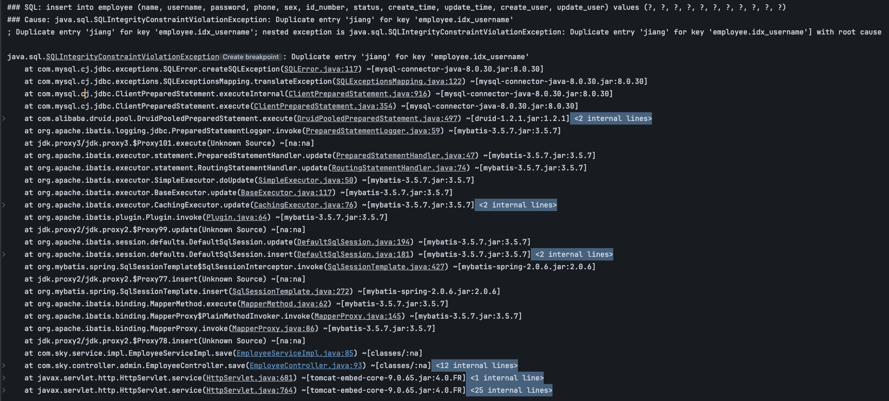

**Solution** - Global Exception Handler:

```java
@ExceptionHandler
public Result exceptionHandler(SQLIntegrityConstraintViolationException ex) {
    String message = ex.getMessage();
    if (message.contains("Duplicate entry")) {
        String[] split = message.split(" ");
        String username = split[2];
        String msg = username + MessageConstant.ALREADY_EXISTS;
        return Result.error(msg);
    } else {
        return Result.error(MessageConstant.UNKNOWN_ERROR);
    }
}
```

**Benefits**:

- Centralized error handling across the application
- User-friendly error messages
- Consistent error response format

## Auto-fill Metadata Fields

**Challenge**: Tracking who created/updated records and when.

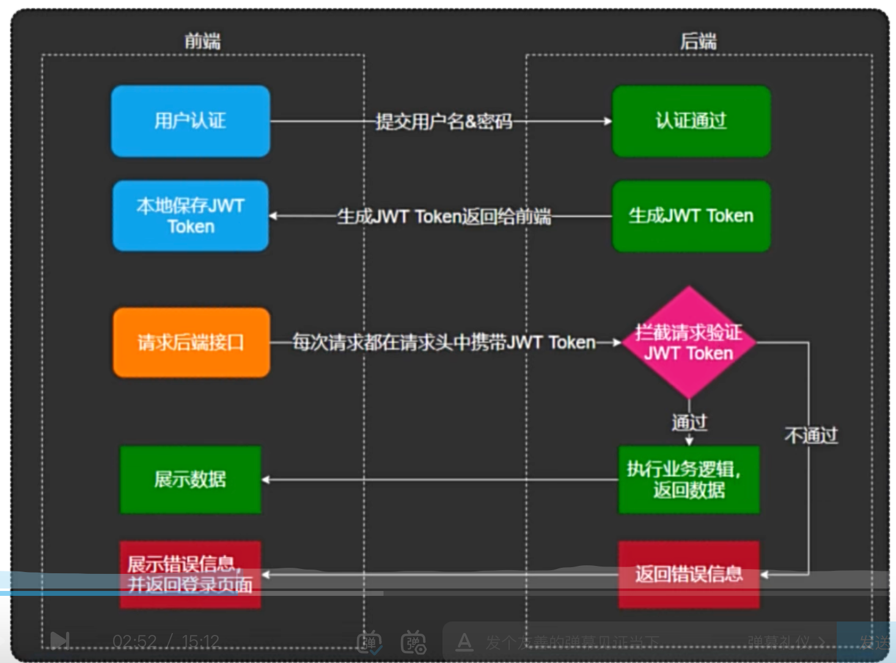

**Solution** - ThreadLocal with AOP:

```java
public class BaseContext {
    private static ThreadLocal<Long> threadLocal = new ThreadLocal<>();
    
    public static void setCurrentId(Long id) {
        threadLocal.set(id);
    }
    
    public static Long getCurrentId() {
        return threadLocal.get();
    }
    
    public static void removeCurrentId() {
        threadLocal.remove();
    }
}
```

**How It Works**:

1. **JWT Interceptor** extracts employee ID from token and stores in ThreadLocal
2. **@AutoFill AOP** reads current user ID and populates metadata fields
3. **Thread Safety** ensures each request has isolated context

**ThreadLocal Benefits**:

- **Thread Isolation**: Each HTTP request runs in its own thread
- **Automatic Cleanup**: ThreadLocal cleared after request completion
- **No Parameter Passing**: Eliminates need to pass user ID through all layers

## Data Transfer Objects

### EmployeeDTO (Request)

```java
@Data
public class EmployeeDTO implements Serializable {
    private Long id;           // Optional for updates
    private String username;   // Unique identifier
    private String name;       // Display name
    private String phone;      // Contact number
    private String sex;        // Gender (1=male, 0=female)
    private String idNumber;   // National ID number
}
```

### Employee Entity (Database)

```java
@Data
@Builder
@NoArgsConstructor
@AllArgsConstructor
public class Employee implements Serializable {
    private Long id;                    // Primary key
    private String username;            // Login username
    private String name;               // Full name
    private String password;           // Encrypted password
    private String phone;              // Phone number
    private String sex;                // Gender
    private String idNumber;           // ID number
    private Integer status;            // 0=disabled, 1=enabled
    private LocalDateTime createTime;  // Creation timestamp
    private LocalDateTime updateTime;  // Last update timestamp
    private Long createUser;           // Creator's employee ID
    private Long updateUser;           // Last updater's employee ID
}
```

## Security Features

1. **Password Encryption**: MD5 hash with default password "123456"
2. **Input Validation**: Bean validation on DTO fields
3. **SQL Injection Prevention**: MyBatis parameter binding
4. **Audit Trail**: Automatic tracking of creation metadata
5. **Authorization**: JWT token required for access

## Testing with Swagger

1. Navigate to `/doc.html`
2. Find "admin employee management" → `POST /admin/employee`
3. Use admin token for authorization
4. Sample test payload:

```json
{
  "name": "Test Employee",
  "username": "test.employee",
  "phone": "13800138000",
  "sex": "1",
  "idNumber": "110101199001010002"
}
```

# Business-Admin: Employee Page Query

### Overview

The employee page query feature provides paginated listing of employees with optional name-based filtering. It uses MyBatis PageHelper for efficient database pagination and supports dynamic search criteria.

### API Endpoint

**GET** `/admin/employee/page?page=1&pageSize=10&name=john`

**Query Parameters**:

- `page`: Page number (starting from 1)
- `pageSize`: Number of records per page
- `name`: Optional name filter (partial match)

**Response**:

```json
{
  "code": 1,
  "msg": null,
  "data": {
    "total": 25,
    "records": [
      {
        "id": 1,
        "username": "admin",
        "name": "Administrator",
        "phone": "13812312312",
        "sex": "1",
        "idNumber": "110101199001010047",
        "status": 1,
        "createTime": "2022-02-15T15:51:20",
        "updateTime": "2022-02-17T09:16:20",
        "createUser": 10,
        "updateUser": 1
      }
    ]
  }
}
```

### Implementation Architecture

#### 1. Controller Layer

```java
@GetMapping("/page")
@ApiOperation("Employee page query")
public Result<PageResult> pageQuery(EmployeePageQueryDTO employeePageQueryDTO) {
    log.info("employee page query: {}", employeePageQueryDTO);
    PageResult pageResult = employeeService.pageQuery(employeePageQueryDTO);
    return Result.success(pageResult);
}
```

**Key Features**:

- **Query Parameter Binding**: Automatic binding to DTO
- **Generic Response**: `Result<PageResult>` for type safety
- **Request Logging**: Comprehensive audit trail

#### 2. Service Layer

```java
public PageResult pageQuery(EmployeePageQueryDTO employeePageQueryDTO) {
    // Configure pagination using PageHelper
    PageHelper.startPage(employeePageQueryDTO.getPage(), 
                         employeePageQueryDTO.getPageSize());
    
    // Execute query - PageHelper intercepts and adds LIMIT clause
    Page<Employee> page = employeeMapper.pageQuery(employeePageQueryDTO);
    
    // Extract pagination results
    long total = page.getTotal();
    List<Employee> records = page.getResult();
    
    return new PageResult(total, records);
}
```

**PageHelper Workflow**:

1. **ThreadLocal Configuration**: `PageHelper.startPage()` sets pagination parameters
2. **Query Interception**: MyBatis plugin intercepts next query
3. **SQL Modification**: Automatically adds `LIMIT` and `COUNT` clauses
4. **Result Extraction**: Returns wrapped `Page<T>` with metadata

#### 3. Data Access Layer

**Mapper Interface**:

```java
Page<Employee> pageQuery(EmployeePageQueryDTO employeePageQueryDTO);
```

**MyBatis XML**:

```xml
<select id="pageQuery" resultType="com.yummy.entity.Employee">
    select * from employee
    <where>
        <if test="name != null and name != ''">
            and name like concat('%', #{name}, '%')
        </if>
    </where>
    order by create_time desc
</select>
```

**Dynamic SQL Features**:

- **Conditional WHERE**: Only applies name filter if provided
- **LIKE Search**: Partial matching with `%` wildcards
- **Default Ordering**: Most recent employees first
- **SQL Injection Safe**: MyBatis parameter binding

### Data Transfer Objects

#### EmployeePageQueryDTO (Request)

```java
@Data
public class EmployeePageQueryDTO implements Serializable {
    private String name;     // Optional search filter
    private int page;        // Page number (1-based)
    private int pageSize;    // Records per page
}
```

#### PageResult (Response)

```java
@Data
@AllArgsConstructor
@NoArgsConstructor
public class PageResult implements Serializable {
    private long total;      // Total number of records
    private List records;    // Current page data
}
```

### Pagination Features

1. **Efficient Counting**: Separate optimized COUNT query
2. **Memory Efficient**: Only loads current page data
3. **Flexible Page Sizes**: Configurable records per page
4. **Search Integration**: Filtering works with pagination
5. **Consistent Ordering**: Stable sort across pages

### Frontend Integration

**Frontend → Backend Data Flow**:

```javascript
// Frontend sends pagination parameters
const params = {
    page: 1,
    pageSize: 10,
    name: 'john'  // Optional search
};

// Backend processes and returns paginated data
{
    total: 25,
    records: [/* current page employees */]
}
```

**Backend → Frontend Data Flow**:

- **Total Records**: For pagination control rendering
- **Current Page**: Employee list for table display
- **Metadata**: Used for "Showing X-Y of Z records" messages

# Business-Admin: Change Employee Status

### Overview

The change employee status feature allows administrators to enable or disable employee accounts. This is implemented using a RESTful approach with the target status passed as a path parameter.

### API Endpoint

**POST** `/admin/employee/status/{status}?id={employeeId}`

**Path Parameters**:

- `status`: Target status (0=disabled, 1=enabled)

**Query Parameters**:

- `id`: Employee ID to update

**Example Requests**:

```bash
# Enable employee
POST /admin/employee/status/1?id=5

# Disable employee  
POST /admin/employee/status/0?id=5
```

**Response**:

```json
{
  "code": 1,
  "msg": null,
  "data": null
}
```

### Implementation Architecture

#### 1. Controller Layer

```java
@PostMapping("/status/{status}")
@ApiOperation("Change employee status")
public Result changeEmployeeStatus(@PathVariable Integer status, Long id) {
    log.info("change employee status: {}, id: {}", status, id);
    employeeService.changeEmployeeStatus(status, id);
    return Result.success();
}
```

**Key Features**:

- **Path Variable**: Status extracted from URL path
- **Query Parameter**: Employee ID from query string
- **RESTful Design**: Uses POST method for state changes

#### 2. Service Layer

```java
@AutoFill(value = OperationType.UPDATE)
public void changeEmployeeStatus(Integer status, Long id) {
    Employee employee = Employee.builder()
            .status(status)
            .id(id)
            .build();
    
    employeeMapper.update(employee);
}
```

**Key Features**:

- **Builder Pattern**: Clean object creation with only required fields
- **Selective Update**: Only updates status field, not entire record
- **Auto-fill Integration**: Automatic update timestamp and user tracking

#### 3. Data Access Layer

**Mapper Interface**:

```java
@AutoFill(value = OperationType.UPDATE)
void update(Employee employee);
```

**MyBatis XML** (Dynamic Update):

```xml
<update id="update" parameterType="com.yummy.entity.Employee">
    update employee
    <set>
        <if test="name != null">name = #{name},</if>
        <if test="username != null">username = #{username},</if>
        <if test="password != null">password = #{password},</if>
        <if test="phone != null">phone = #{phone},</if>
        <if test="sex != null">sex = #{sex},</if>
        <if test="idNumber != null">id_number = #{idNumber},</if>
        <if test="status != null">status = #{status},</if>
        <if test="updateTime != null">update_time = #{updateTime},</if>
        <if test="updateUser != null">update_user = #{updateUser},</if>
    </set>
    where id = #{id}
</update>
```

**Benefits**:

- **Selective Updates**: Only modifies non-null fields
- **Prevents Overwrites**: Avoids accidentally clearing other fields
- **Optimized SQL**: Generates minimal UPDATE statements

### Status Management

#### Status Values

- **0**: Disabled/Inactive - Employee cannot login
- **1**: Enabled/Active - Employee can login normally

#### Business Rules

1. **Self-Modification**: Employees cannot disable their own accounts
2. **Admin Protection**: Super admin account cannot be disabled
3. **Active Sessions**: Disabled employees are logged out immediately
4. **Audit Trail**: All status changes are tracked with timestamp and modifier

### Security Considerations

1. **Authorization Check**: Only admin users can change employee status
2. **Validation**: Ensure status values are valid (0 or 1)
3. **Business Rules**: Prevent self-disabling and admin account lockout
4. **Audit Logging**: Track who changed what and when

# Business-Admin: Edit Employee

### Overview

The edit employee feature provides two operations: retrieving employee details for editing and updating employee information. It implements password masking for security and supports partial updates.

### API Endpoints

#### Get Employee by ID

**GET** `/admin/employee/{id}`

**Path Parameters**:

- `id`: Employee ID to retrieve

**Response**:

```json
{
  "code": 1,
  "msg": null,
  "data": {
    "id": 1,
    "username": "admin",
    "name": "Administrator", 
    "password": "****",
    "phone": "13812312312",
    "sex": "1",
    "idNumber": "110101199001010047",
    "status": 1,
    "createTime": "2022-02-15T15:51:20",
    "updateTime": "2022-02-17T09:16:20",
    "createUser": 10,
    "updateUser": 1
  }
}
```

#### Update Employee

**PUT** `/admin/employee`

**Request Body** (`EmployeeDTO`):

```json
{
  "id": 1,
  "name": "Updated Name",
  "username": "admin",
  "phone": "13800138000",
  "sex": "1",
  "idNumber": "110101199001010047"
}
```

**Response**:

```json
{
  "code": 1,
  "msg": null,
  "data": null
}
```

### Implementation Architecture

#### 1. Get Employee by ID

**Controller**:

```java
@GetMapping("/{id}")
@ApiOperation("Get employee by ID")
public Result<Employee> getById(@PathVariable Long id) {
    Employee employee = employeeService.getById(id);
    return Result.success(employee);
}
```

**Service**:

```java
public Employee getById(Long id) {
    Employee employee = employeeMapper.getById(id);
    // Mask password for security
    employee.setPassword("****");
    return employee;
}
```

**Mapper**:

```java
@Select("select * from employee where id = #{id}")
Employee getById(Long id);
```

**Security Features**:

- **Password Masking**: Real password never returned to frontend
- **Complete Data**: All other fields returned for form population
- **Not Found Handling**: Returns null if employee doesn't exist

#### 2. Update Employee

**Controller**:

```java
@PutMapping
@ApiOperation("Update employee")
public Result update(@RequestBody EmployeeDTO employeeDTO) {
    log.info("update employee: {}", employeeDTO);
    employeeService.update(employeeDTO);
    return Result.success();
}
```

**Service**:

```java
@AutoFill(value = OperationType.UPDATE)
public void update(EmployeeDTO employeeDTO) {
    Employee employee = new Employee();
    BeanUtils.copyProperties(employeeDTO, employee);
    employeeMapper.update(employee);
}
```

**Key Features**:

- **DTO to Entity**: Uses `BeanUtils.copyProperties()` for field mapping
- **Partial Updates**: Only updates provided fields via dynamic SQL
- **Auto-fill**: Automatic update timestamp and user tracking
- **RESTful Design**: Uses PUT method for updates

### Frontend Integration Workflow

#### Edit Flow

1. **Load Employee**: Frontend calls `GET /admin/employee/{id}`
2. **Populate Form**: Form fields filled with returned data
3. **User Edits**: User modifies desired fields
4. **Submit Update**: Frontend calls `PUT /admin/employee` with changes
5. **Refresh List**: Page refreshes to show updated data

#### Form Handling

```javascript
// 1. Load employee for editing
const loadEmployee = async (id) => {
    const response = await fetch(`/admin/employee/${id}`);
    const result = await response.json();
    // result.data.password will be "****"
    populateForm(result.data);
};

// 2. Submit updates
const updateEmployee = async (employeeData) => {
    await fetch('/admin/employee', {
        method: 'PUT',
        headers: { 'Content-Type': 'application/json' },
        body: JSON.stringify(employeeData)
    });
};
```

### Data Validation

#### Update Constraints

1. **Required Fields**: ID is required for updates
2. **Username Uniqueness**: Cannot change to existing username
3. **Business Rules**: Cannot change own username or critical fields
4. **Format Validation**: Phone, ID number format checks

#### Field-Level Validation

- **Phone**: Chinese mobile number format (11 digits starting with 1)
- **ID Number**: Chinese national ID format (18 digits)
- **Sex**: Valid values (0=female, 1=male)
- **Username**: Alphanumeric characters and periods only

### Security Features

1. **Password Protection**: Never expose real passwords
2. **Selective Updates**: Only modify intended fields
3. **Audit Trail**: Track all modifications with user and timestamp
4. **Authorization**: Require admin privileges
5. **Input Validation**: Prevent malicious data injection

# Business-Admin: Category - add new category

# Business-Admin: Category - page query

#TODO: all about category need to be completed in .md file

# Business-Admin: Auto fill public field

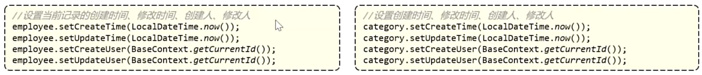

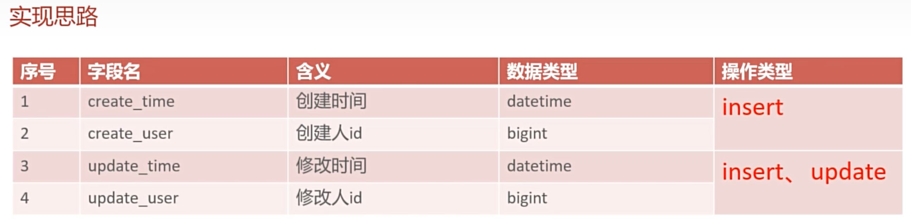

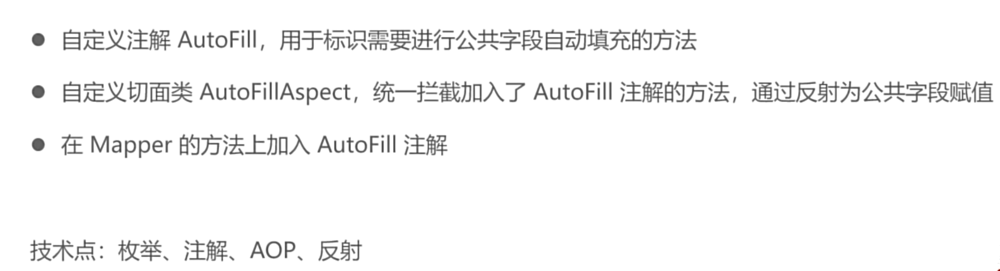

- enum
- annotation
- AOP
- reflection

### Annotation: AutoFill


### Enum: OperationType

# Business-Admin: Alioss Util

#TODO: not understand yet

- `AliOss.upload()` 

# Business-Admin: Add new dishes

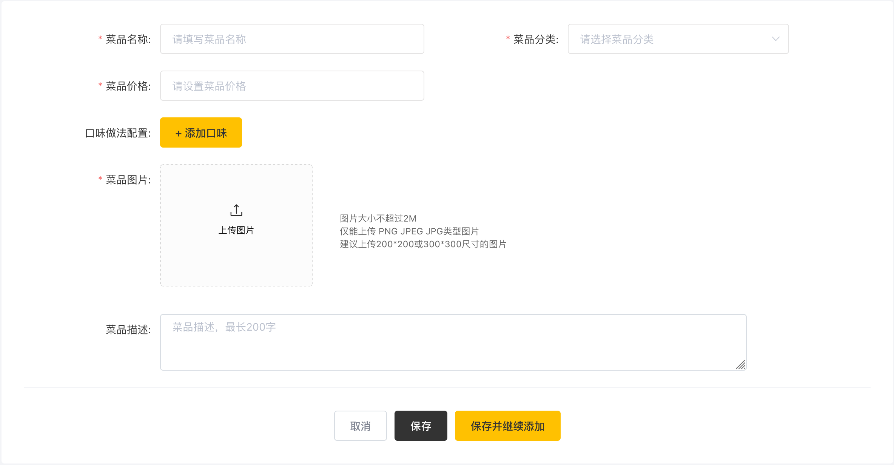

### upload picture and store locally

- WebMvcConfiguration ==> set up static resource mapping

  ```java
  protected void addResourceHandlers(ResourceHandlerRegistry registry) {
  
    registry.addResourceHandler("/doc.html").addResourceLocations("classpath:/META-INF/resources/");
    registry.addResourceHandler("/webjars/**").addResourceLocations("classpath:/META-INF/resources/webjars/");
    registry.addResourceHandler("/upload/**")
            .addResourceLocations("file:" + uploadDir + "/");
  }
  ```

- nginx !!! You have to set the reverse proxy !!!

  ```nginx
  location /upload/ {
      proxy_pass http://localhost:4041/upload/;
  }
  ```

- application-dev.yml

  ```yaml
  yummy:  
  	file:
      upload-dir: /Users/hurjiang/Documents/101_cs_hc/101_cs_code/yummy-spicy/yummy-backend/yummy-server/src/main/resources/upload
      access-url: http://localhost:4040/upload
  ```

  

- "\upload"

  ```java
  @PostMapping("/upload")
  @ApiOperation("Upload files locally")
  public Result<String> uploadLocally(MultipartFile file) {
      String filename = file.getOriginalFilename();
      String extension = filename.substring(filename.lastIndexOf('.'));
      String newFileName = UUID.randomUUID().toString() + extension;
      File dest = new File(uploadDir + File.separator + newFileName);
      try {
          file.transferTo(dest);
          // 返回前端可访问的 URL
          String fileUrl = accessUrl + "/" + newFileName;
          return Result.success(fileUrl);
      } catch (IOException e) {
          log.error(MessageConstant.UPLOAD_FAILED, e);
      }
      return Result.error(MessageConstant.UPLOAD_FAILED);
  }
  ```

  

# Business-Admin: Dish page query

- Frontend pass `DishDTO` to the Backend

- Controller receive `DishDTO` and Controller will return `Result<PageResult>` back to Frontend

- `DishServiceImpl`:

  - `Page<DishVO> page = dishMapper.pageQuery(dishPageQueryDTO);` 

- `DishMapper.xml` 

  ```xml
  <select id="pageQuery" resultType="com.yummy.vo.DishVO">
          select d.*, c.name as categoryName from dish d left join category c on d.category_id = c.id
      <where>
          <if test="name != null">
              and d.name like concat('%', #{name}, '%')
          </if>
          <if test="categoryId != null">
              and d.category_id = #{categoryId}
          </if>
          <if test="status != null">
              and d.status = #{status}
          </if>
      </where>
      order by d.create_time desc
  </select>
  ```

  ## delete dish

  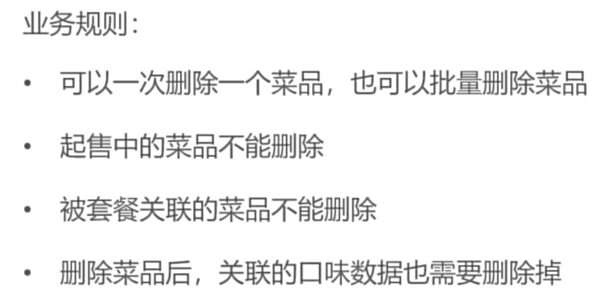

  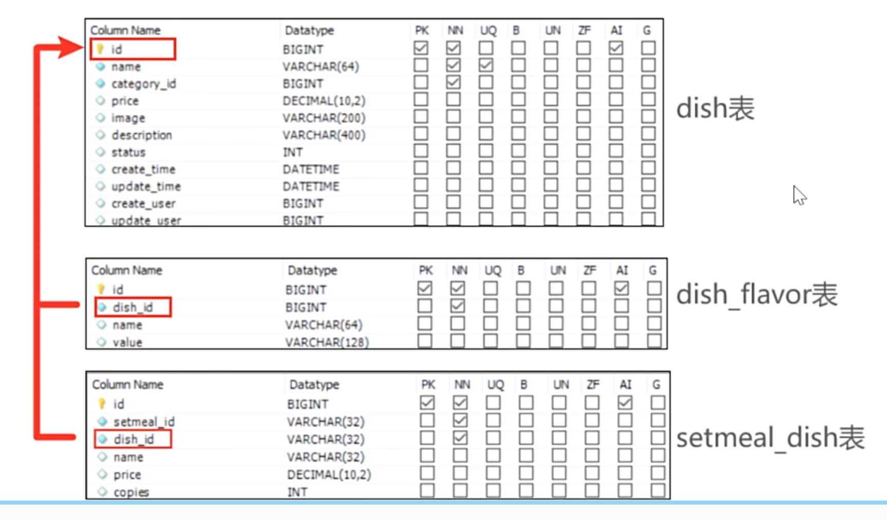

# Business-Admin: Update dishes


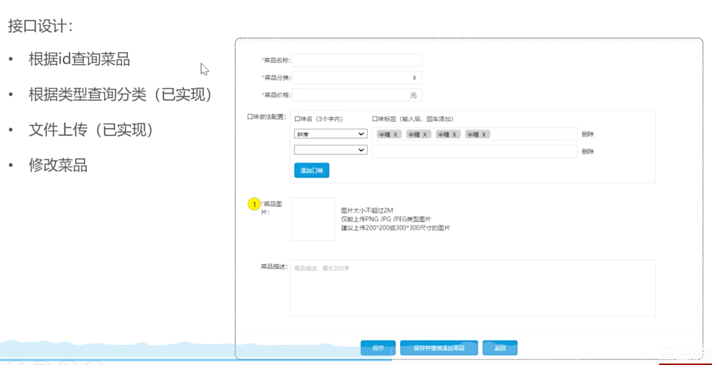

### get dish by id

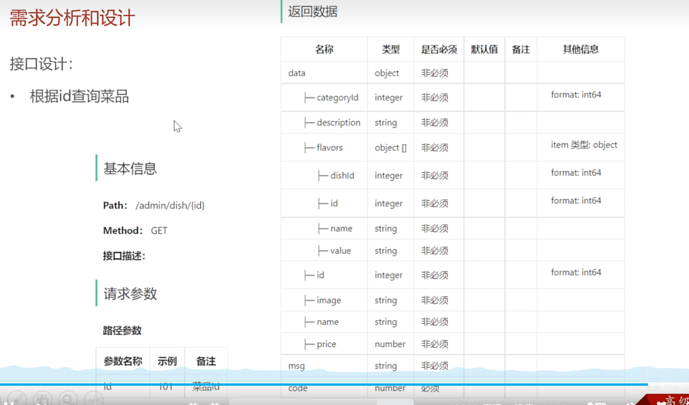

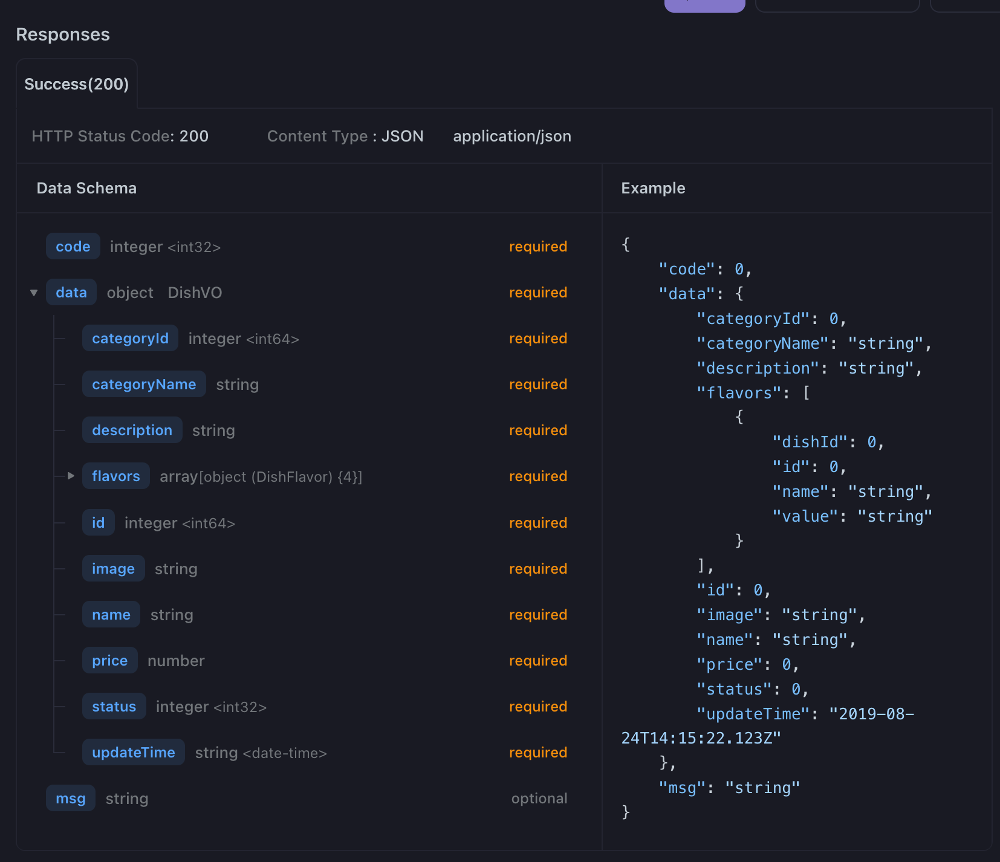

### update dish

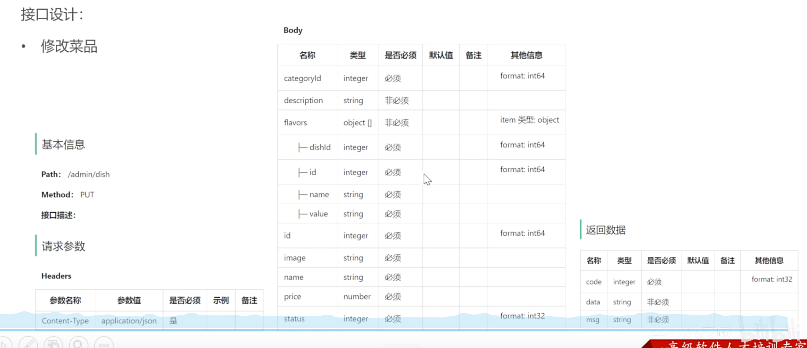

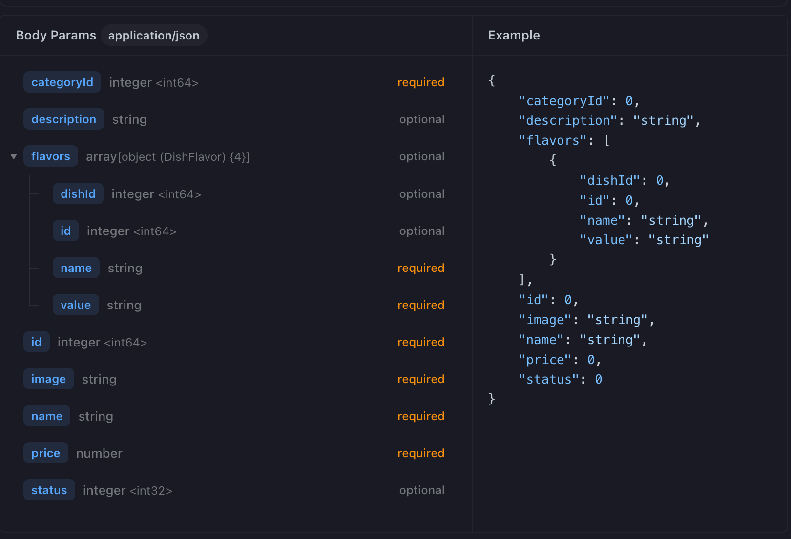

# Business-Admin: Setmeal

### Task

- Complete all business functions of the Package Management module, including:

  - Adding new set meal
  - set meal paging query
  - Delete set meal
  - Modify set meal
  - enable or disable set meal

- Requirements:
  1. conduct requirement analysis based on product prototype, analyze the business rules
  2. Design interfaces
  3. sort out the relationship between tables (category table, dish table, set menu table, flavor table, set menu dish relationship table)
  4. code implementation according to the interface design
  5. testing the functionality through swagger interface documentation and front-end and back-end tuning respectively.

### add new setmeal

#### list dish by category id

- How to search by name of dish?
  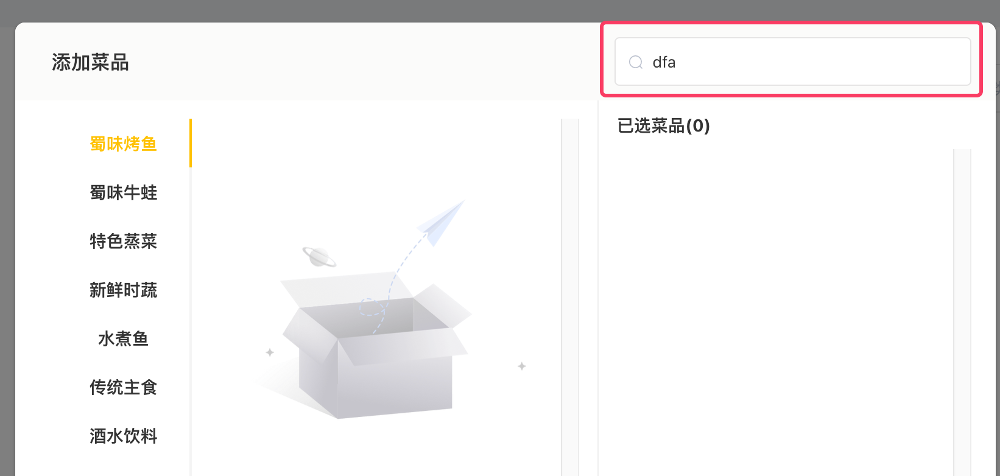

### setmeal paging query

- User SetmealVO

  ```java
  Page<SetmealVO> page = setmealMapper.pageQuery(setmealPageQueryDTO);
  ```

- SQL

  ```xml
  <select id="pageQuery" resultType="com.yummy.vo.SetmealVO">
      select sm.*, ct.name from setmeal sm left join category ct on sm.category_id = ct.id
      <where>
          <if test="name != null"> and sm.name like concat('%', #{name}, '%') </if>
          <if test="categoryId != null"> and sm.category_id = #{categoryId}</if>
          <if test="status != null"> and sm.status = #{status} </if>
      </where>
      order by create_time desc
  </select>
  ```

  

### delete setmeal

### update setmeal

### enable or disable setmeal

# Business-Admin: Restaurant status

- no need to create a new table in MySQL for restaurant status, we use Redis!

# Business-Client: WeChat Login

### Overview

The WeChat login feature enables users to authenticate using their WeChat Mini Program credentials. The system exchanges a WeChat-provided code for a unique OpenID, which is used to identify and authenticate users.

### Architecture

#### System Flow Diagram

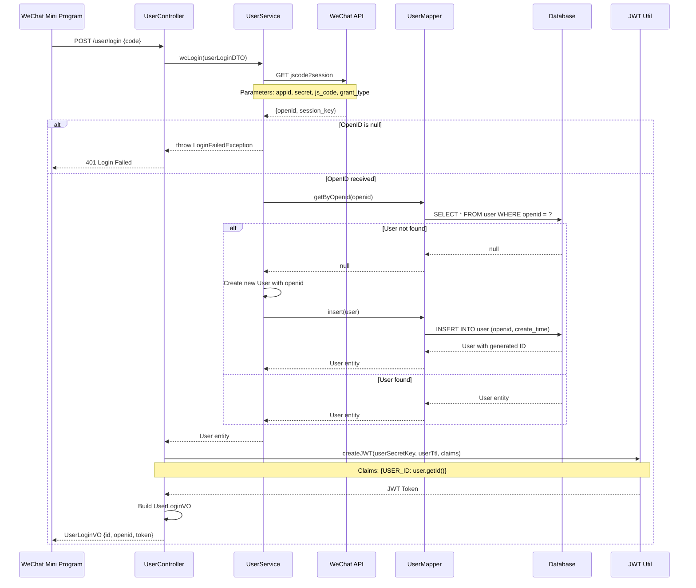

#### Component Architecture

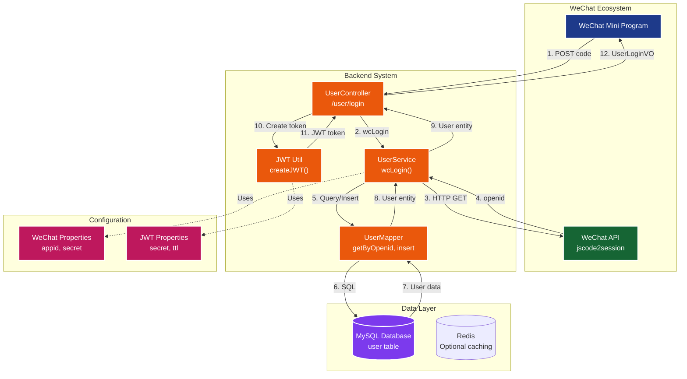

### Implementation

#### API Endpoint

- **POST** `/user/login`

- **Request Body**: `UserLoginDTO`

  ```json
  {
    "code": "WeChat_authorization_code"
  }
  ```

- **Response**: `UserLoginVO`

  ```json
  {
    "id": 1,
    "openid": "wechat_openid",
    "token": "jwt_token"
  }
  ```

#### Core Components

##### 1. UserController (`/user/login`)

- Receives WeChat login request with authorization code
- Calls `UserService.wcLogin()` to process login
- Creates JWT token with user ID
- Returns `UserLoginVO` with user info and token

##### 2. UserService Implementation

**wcLogin() Method Process:**

1. **Exchange Code for OpenID**: Calls WeChat API to get unique OpenID
2. **User Validation**: Checks if OpenID exists in database
3. **User Creation**: Creates new user record if first-time login
4. **Return User**: Returns user entity for JWT token creation

**getOpenid() Method:**

- Makes HTTP GET request to WeChat API endpoint
- Parameters: `appid`, `secret`, `js_code`, `grant_type`
- Parses JSON response to extract OpenID

##### 3. UserMapper

- **getByOpenid()**: Queries user by WeChat OpenID
- **insert()**: Creates new user record with auto-generated ID

#### Database Schema

**User Table:**

```sql
CREATE TABLE user (
    id BIGINT AUTO_INCREMENT PRIMARY KEY,
    openid VARCHAR(45) UNIQUE NOT NULL,
    name VARCHAR(32),
    phone VARCHAR(11),
    sex VARCHAR(2),
    id_number VARCHAR(18),
    avatar VARCHAR(500),
    create_time DATETIME
);
```

#### Configuration

**WeChat Properties** (`application.yml`):

```yaml
yummy:
  wechat:
    appid: your_wechat_mini_program_appid
    secret: your_wechat_mini_program_secret
  jwt:
    user-secret-key: your_jwt_secret
    user-ttl: 72000000  # 20 hours
    user-token-name: authentication
```

#### Security Features

1. **JWT Token Authentication**
   - Separate secret key for user tokens
   - 20-hour token expiration
   - Token contains user ID claim

2. **OpenID Validation**
   - Validates OpenID received from WeChat API
   - Throws `LoginFailedException` for invalid responses

3. **Automatic User Registration**
   - Creates new user on first login
   - Stores WeChat OpenID and creation timestamp

#### Error Handling

- **Invalid Code**: Returns 401 if WeChat API returns no OpenID
- **API Failure**: Handles WeChat API communication errors
- **Database Errors**: Manages user creation/retrieval failures

#### Dependencies

- **FastJSON**: JSON parsing for WeChat API responses
- **HttpClient**: HTTP communication with WeChat API
- **MyBatis**: Database operations
- **JWT Util**: Token creation and validation

#### Testing

Use Swagger UI to test the login endpoint:

1. Navigate to `/doc.html`
2. Find `user-controller` → `POST /user/login`
3. Provide WeChat authorization code
4. Verify response contains user info and JWT token

### WeChat API Integration

**Endpoint**: `https://api.weixin.qq.com/sns/jscode2session`

**Request Parameters**:

- `appid`: Mini Program App ID
- `secret`: Mini Program App Secret  
- `js_code`: Authorization code from WeChat
- `grant_type`: Must be "authorization_code"

**Response**:

```json
{
  "openid": "user_unique_id",
  "session_key": "session_key",
  "unionid": "union_id" // Optional
}
```

### Security Considerations

1. **Never expose WeChat App Secret** in client-side code
2. **Validate all WeChat API responses** before processing
3. **Use HTTPS** for all WeChat API communications
4. **Implement rate limiting** to prevent abuse
5. **Store JWT tokens securely** on client side


# Business-Client: List dishes in mini program

# Business-Client: Cache dish

### Purpose

When many users visit and send request to backend and read database, it will make read operation not efficient. To solve this problem we use Redis to store cache data, avoding read operation to database all the time

### Architecture

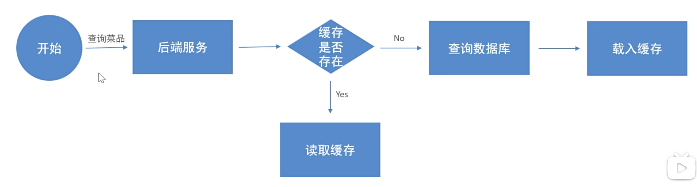

### Analysis

- one category will be stored as one cache data (one key-value)
  - key: dish_{category id}
  - value: dishes in this category (in string form)
- when the dish data in database change, we have to clear the cache data (when should we clear cache data?) ==> when the api blow is invoked, the cache data should be cleared.
  - update dish
  - delete dish
  - change status
  - add new dish

### Implementation

#### User/DishController

```java
@GetMapping("/list")
@ApiOperation("search dish by category id")
public Result<List<DishVO>> list(Long categoryId) {

    // redis key: "dish_" + categoryId
    String key = "dish_" + categoryId;
    // Does dish data exist in redis?
    List<DishVO> list = (List<DishVO>) redisTemplate.opsForValue().get(key);
    // 1. yes, exist
    if (list != null && list.size() > 0) {
        return Result.success(list);
    }
    // 2. no, doesn't exist
    Dish dish = new Dish();
    dish.setCategoryId(categoryId);
    dish.setStatus(StatusConstant.ENABLE);// search which is on sale

    list = dishService.listWithFlavor(dish);
    redisTemplate.opsForValue().set(key, list);

    return Result.success(list);
}
```

#### Admin/DishController

- clear cache in each operation (update, add new, change status...)

# Business-Client: Cache setmeal


### Spring Cache

- `@EnableCaching`
- `@Cacheable`
- `@CacheEvict`
- 

# Business-Client: Shopping cart

## Add shopping cart

- From Frontend: `dishId, setmealId, dishFlavor` and `ShoppingCartDTO`
- Step 1: check if this shopping cart exists
- Step 2: check if it is dish or setmeal

## List/Show shopping cart

- show the shopping cart by userId

## Clear shopping cart

# Business-Client: Address book

## Add a new address book

## List addresses by userId

## Update address book

- here needs two api
  - get address by id
  - update address by id

## Set default address

## Delete address by id

## Get default address

# Business-Client: submit order

## WeChat Pay

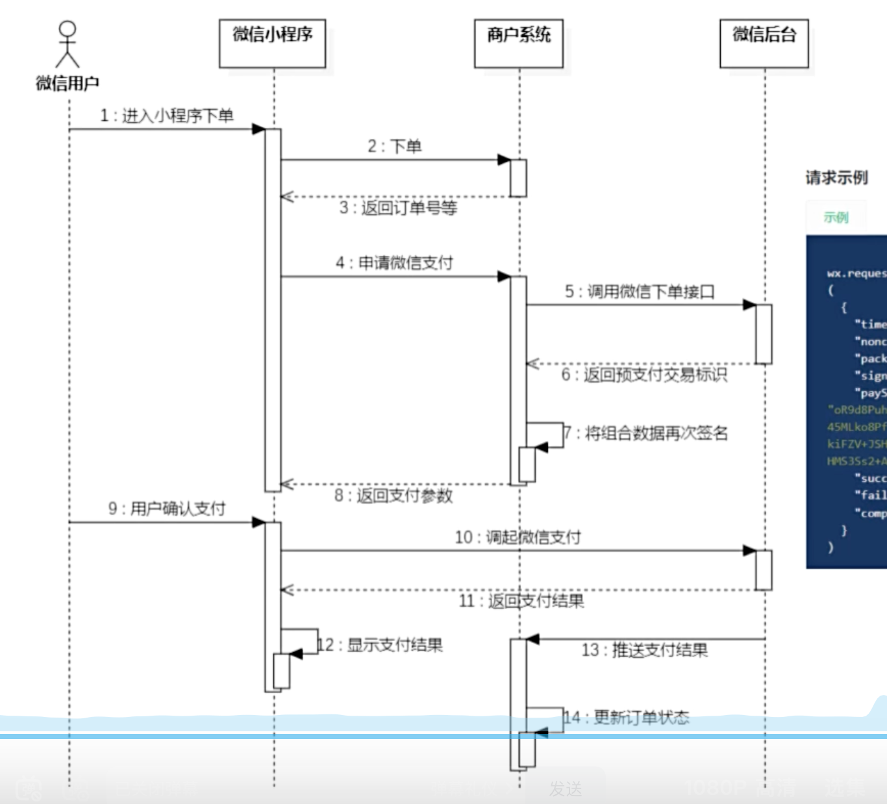

