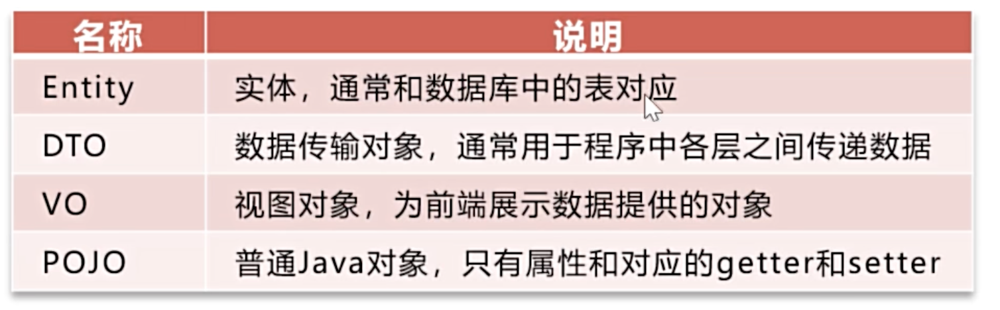
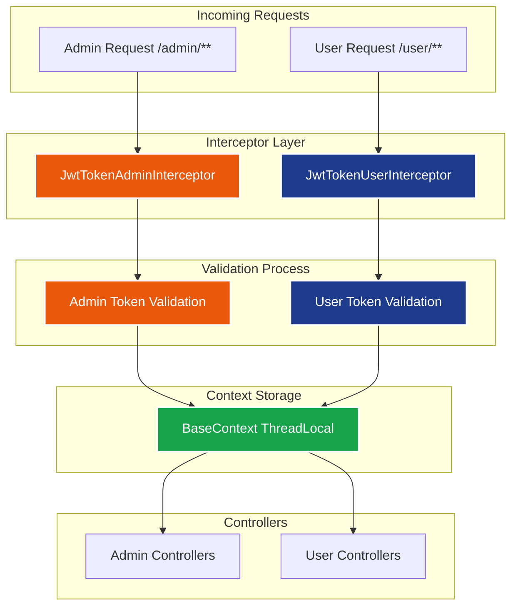

# 1. Layered architecture and Maintainability

## 1.1 Controller / Service / Repository(Mapper) 分层
- Controller: 接收 HTTP 请求, 参数校验, 调用 Service, 返回 HTTP 响应
- Service: 业务规则, 事务, 状态流转, 跨表操作
- Repository/Mapper: 和数据库打交道, CRUD, 查询优化
## 1.2 DTO/VO

- avoid exposing of Entity

| Name                           | ..                                   |
| ------------------------------ | ------------------------------------ |
| Entity                         | ORM, database reflection             |
| DTO (Data Transmission Object) | data transmitted through layers      |
| VO (View Data)                 | for frontend, service ==> controller |
| POJO                           | Java Object                          |

- Why do we use DTO, VO instead of Entity directly?
	- Because entities represent persistence concerns, while APIs should be decoupled from database structure.



## 1.3 Global Exception Handler (@ControllerAdvice / 自定义异常 / 错误码)

- a centralized mechanism that catches and handles unhandled or unexpected exceptions that occur anywhere in the application ==> it avoids writing repetitive try-catch block in multiple places
## 1.4 统一返回格式 (Response wrapper)

# 2. Authentication and Authorization
## 2.1 JWT Token Interceptors

The application uses Spring MVC interceptors to validate JWT tokens for both admin employees and WeChat users. These interceptors provide automatic authentication and authorization for protected endpoints.

### Overview

The system implements **dual JWT authentication** with separate interceptors:

1. **JwtTokenAdminInterceptor** - For admin employee authentication
2. **JwtTokenUserInterceptor** - For WeChat user authentication

### Architecture



### Admin JWT Interceptor

#### Purpose

Validates JWT tokens for admin employee requests to ensure only authenticated employees can access admin functionality.

#### Configuration

- **Path Patterns**: `/admin/**`
- **Exclusions**: `/admin/employee/login`
- **Token Header**: `"token"`
- **Secret Key**: `adminSecretKey`
- **Claim**: `EMP_ID`

#### Implementation Details

```java
@Component
public class JwtTokenAdminInterceptor implements HandlerInterceptor {
    
    public boolean preHandle(HttpServletRequest request, 
                           HttpServletResponse response, 
                           Object handler) throws Exception {
        
        // 1. Extract token from "token" header
        String token = request.getHeader(jwtProperties.getAdminTokenName());
        
        // 2. Validate token with admin secret key
        Claims claims = JwtUtil.parseJWT(jwtProperties.getAdminSecretKey(), token);
        
        // 3. Extract employee ID from claims
        Long empId = Long.valueOf(claims.get(JwtClaimsConstant.EMP_ID).toString());
        
        // 4. Store in thread local context
        BaseContext.setCurrentId(empId);
        
        return true; // Allow request to proceed
    }
}
```

#### Request Flow

```
Admin Login → JWT Token → Request with "token" header → 
Admin Interceptor → Validation → Employee ID in Context → Admin Controller
```

### User JWT Interceptor

#### Purpose

Validates JWT tokens for WeChat user requests to ensure only authenticated users can access user-specific functionality.

#### Configuration

- **Path Patterns**: `/user/**`
- **Exclusions**: `/user/login`
- **Token Header**: `"authentication"`
- **Secret Key**: `userSecretKey`
- **Claim**: `USER_ID`

#### Implementation Details

```java
@Component
public class JwtTokenUserInterceptor implements HandlerInterceptor {
    
    public boolean preHandle(HttpServletRequest request, 
                           HttpServletResponse response, 
                           Object handler) throws Exception {
        
        // 1. Extract token from "authentication" header
        String token = request.getHeader(jwtProperties.getUserTokenName());
        
        // 2. Validate token with user secret key
        Claims claims = JwtUtil.parseJWT(jwtProperties.getUserSecretKey(), token);
        
        // 3. Extract user ID from claims
        Long userId = Long.valueOf(claims.get(JwtClaimsConstant.USER_ID).toString());
        
        // 4. Store in thread local context
        BaseContext.setCurrentId(userId);
        
        return true; // Allow request to proceed
    }
}
```

#### Request Flow

```
WeChat Login → JWT Token → Request with "authentication" header → 
User Interceptor → Validation → User ID in Context → User Controller
```

### Interceptor Comparison

| Feature             | Admin Interceptor       | User Interceptor   |
| ------------------- | ----------------------- | ------------------ |
| **Target Users**    | Admin employees         | WeChat users       |
| **Path Pattern**    | `/admin/**`             | `/user/**`         |
| **Excluded Paths**  | `/admin/employee/login` | `/user/login`      |
| **Token Header**    | `"token"`               | `"authentication"` |
| **Secret Key**      | `adminSecretKey`        | `userSecretKey`    |
| **JWT Claim**       | `EMP_ID`                | `USER_ID`          |
| **Token TTL**       | 20 hours                | 20 hours           |
| **Context Storage** | Employee ID             | User ID            |

### Registration in WebMvcConfiguration

```java
@Configuration
public class WebMvcConfiguration extends WebMvcConfigurationSupport {
    
    @Autowired
    private JwtTokenAdminInterceptor jwtTokenAdminInterceptor;
    @Autowired
    private JwtTokenUserInterceptor jwtTokenUserInterceptor;
    
    @Override
    protected void addInterceptors(InterceptorRegistry registry) {
        // Register admin JWT interceptor
        registry.addInterceptor(jwtTokenAdminInterceptor)
                .addPathPatterns("/admin/**")
                .excludePathPatterns("/admin/employee/login");
        
        // Register user JWT interceptor
        registry.addInterceptor(jwtTokenUserInterceptor)
                .addPathPatterns("/user/**")
                .excludePathPatterns("/user/login");
    }
}
```

### BaseContext ThreadLocal

Both interceptors use `BaseContext` to store the authenticated user/employee ID in thread-local storage:

```java
public class BaseContext {
    private static ThreadLocal<Long> threadLocal = new ThreadLocal<>();
    
    public static void setCurrentId(Long id) {
        threadLocal.set(id);
    }
    
    public static Long getCurrentId() {
        return threadLocal.get();
    }
    
    public static void removeCurrentId() {
        threadLocal.remove();
    }
}
```

#### Usage in Controllers

```java
// In any controller method after interceptor validation
Long currentUserId = BaseContext.getCurrentId();
Long currentEmployeeId = BaseContext.getCurrentId();
```

### Error Handling

Both interceptors handle authentication failures consistently:

#### Invalid Token Scenarios

- **Missing Token**: No token in request header
- **Malformed Token**: Invalid JWT format
- **Expired Token**: Token past expiration time
- **Invalid Signature**: Token signature verification fails
- **Wrong Secret**: Token signed with different secret key

#### Error Response

```http
HTTP/1.1 401 Unauthorized
Content-Length: 0
```

### Security Features

#### 1. **Automatic Protection**

- All protected endpoints require valid JWT tokens
- No manual token validation needed in controllers
- Consistent security across the application

#### 2. **Stateless Authentication**

- No server-side session storage required
- Tokens contain all necessary authentication information
- Horizontal scaling friendly

#### 3. **Role Separation**

- Clear separation between admin and user tokens
- Different secret keys prevent token cross-usage
- Isolated authentication domains

#### 4. **Request Context**

- Authenticated user/employee ID available throughout request
- Stored in thread-local storage for thread safety
- Automatic cleanup after request completion

#### 5. **Fail-Safe Design**

- Invalid tokens immediately rejected
- Clear error responses for debugging
- Comprehensive logging for security monitoring

### Testing with Swagger

#### Admin Endpoints

1. Login via `/admin/employee/login` to get admin token
2. Use "Authorize" button in Swagger UI
3. Enter token in "token" field
4. Test protected admin endpoints

#### User Endpoints

1. Login via `/user/login` to get user token
2. Use "Authorize" button in Swagger UI
3. Enter token in "authentication" field
4. Test protected user endpoints

### Best Practices

1. **Token Storage**: Store tokens securely on client side
2. **Token Refresh**: Implement token refresh mechanism for long sessions
3. **Logout**: Clear tokens on client logout
4. **HTTPS**: Always use HTTPS in production
5. **Monitoring**: Log authentication failures for security analysis

# 3. Database and Transactions

# 4. Caching and Performance

# 5. Concurrency and Consistency

# 6. Project engineering

# Message converter of Spring MVC