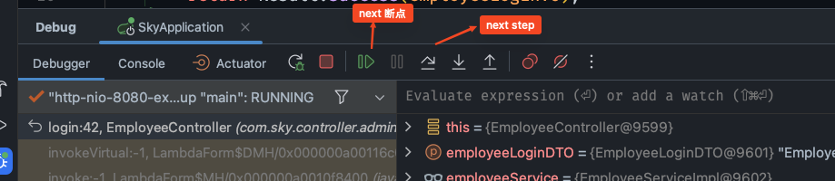
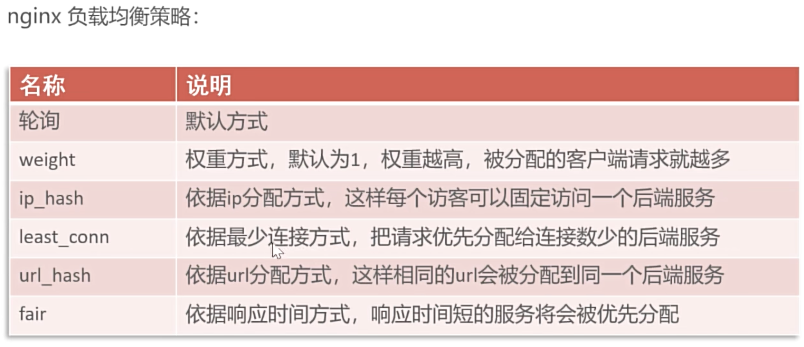
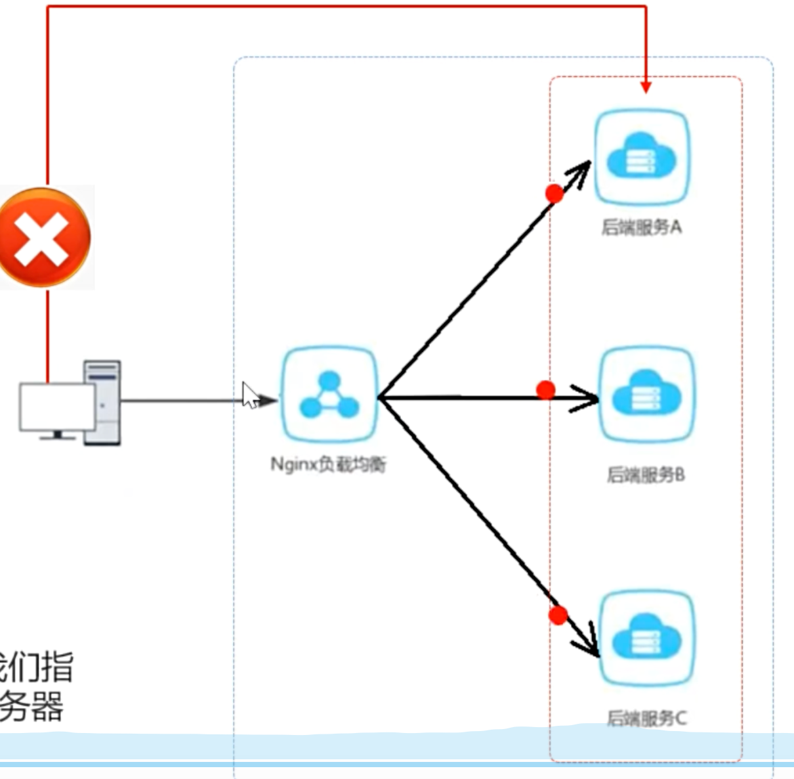

# Frontend

## Project Structure

The frontend consists of:

- **Admin Web Interface**: Restaurant management dashboard
- **WeChat Mini Program**: Customer ordering interface  
- **Nginx Server**: Reverse proxy and static file serving

## Quick Start

### Running the Frontend (macOS)

1. **Start Nginx**:

   ```bash
   sudo nginx -c /your/path/to/nginx.conf
   ```

2. **Access Application**:

   - Admin Dashboard: `http://localhost`
   - API Base URL: `http://localhost/api/` 

## Nginx

- debug

  

- Nginx reverse proxy

  - 

  - what is it?

    - request address in browser http://localhost/api/employee/login and in backend /admin/employee/login --> this is Nginx reverse proxy

    - browser doesn't and can't send request to backend directly, it should send to Nginx server first and Nginx server will forward it to the backend

    - ```nginx
      server {
        listen 80;
        server_name localhost;
        location /api/ {
          proxy_pass http://localhost:8080/admin/;
        }
      }
      ```

    - 

  - why use it?

    - make sure that browser can't visit backend server directly so server can be safe
    - when there are a lot request from frontend, Nginx server will help to send request to different server, lower the load of one server
    - some resource/static site will be stored in Nginx server and when you visit it again, no need to go to backend server, Nginx can response to that request directly

  - advantages

    - raise visit speed

    - load balancing (负载均衡)

      ```nginx
      upstream webservers {
      	  server 127.0.0.1:8080 weight=90 ;
      	  #server 127.0.0.1:8088 weight=10 ;
      }
      server {
        listen 80;
        server_name localhost;
        location /api/ {
          proxy_pass http://webservers/admin/;
        }
      }
      ```

      

    - ensure security of backend server

    - 

- Is nginx running correctly?

  - `ps aux | grep nginx` : will print out the running nginx information

## Nginx Management

### Development Commands

- **Check running status**: `ps aux | grep nginx`
- **Check port listening**: `lsof -i :80` (replace 80 with your port)
- **Test configuration**: `sudo nginx -t -c /your/custom/path/nginx.conf`
- **Start server**: `sudo nginx -c /your/path/to/nginx.conf`
- **Reload configuration**: `sudo nginx -s reload`
- **Stop server**: `sudo nginx -s stop`

### Troubleshooting

- **Port conflicts**: Use `lsof -i :PORT` to check what's using a specific port
- **Configuration errors**: Run `sudo nginx -t` to validate config syntax
- **Permission issues**: Ensure proper file permissions for config and web root directories 

